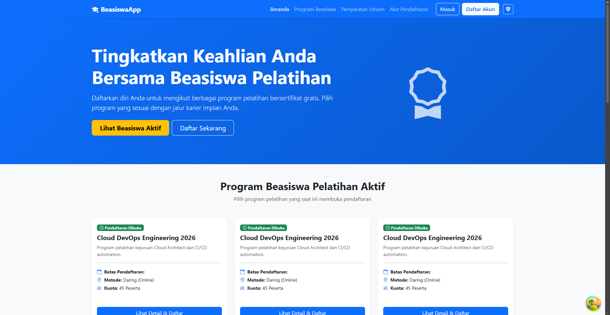
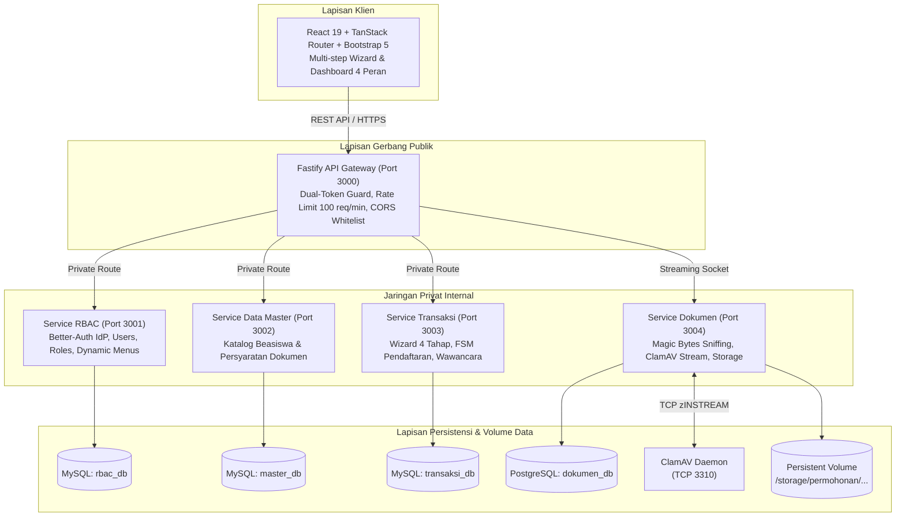

# BeasiswaApp: Platform Pendaftaran dan Seleksi Beasiswa Pelatihan



*Antarmuka beranda publik BeasiswaApp yang menampilkan katalog program beasiswa pelatihan aktif, navigasi alur pendaftaran, dan modul autentikasi akun.*

---

## Ringkasan sistem

BeasiswaApp adalah platform pendaftaran dan seleksi beasiswa pelatihan berbasis mikroservis modular. Sistem ini mengadopsi pola monorepo terisolasi selama proses pengembangan lokal dan mendistribusikan kode ke 7 repositori mandiri di GitHub untuk deployment produksi.

Sistem menangani alur pendaftaran 4 tahap, verifikasi administrasi dua panel, rubrik penilaian wawancara terbobot, isolasi berkas unggahan, serta pemindaian malware otomatis melalui ClamAV daemon.

---

## Arsitektur dan dekomposisi layanan

Sistem terbagi ke dalam 6 modul aplikasi mandiri dan 1 paket kontrak bersama:

| Modul | Direktori sumber | Repositori rilis GitHub | Port layanan | Teknologi utama |
| :-- | :-- | :-- | :-- | :-- |
| **API Gateway** | `apps/api-gateway` | `puruhitaaa/beasiswaapp-api-gateway` | 3000 (Publik) | Fastify, Jose, Rate Limit, Http Proxy |
| **Frontend Web** | `apps/web` | `puruhitaaa/beasiswaapp-web` | 3001 (Publik) | React 19, TanStack Router, TanStack Form, Bootstrap 5 |
| **Service RBAC** | `apps/service-rbac` | `puruhitaaa/beasiswaapp-service-rbac` | 3001 (Privat) | Node.js, Better-Auth, Prisma, MySQL |
| **Service Data Master** | `apps/service-master` | `puruhitaaa/beasiswaapp-service-master` | 3002 (Privat) | Node.js, Fastify, Prisma, MySQL |
| **Service Transaksi** | `apps/service-transaksi` | `puruhitaaa/beasiswaapp-service-transaksi` | 3003 (Privat) | Node.js, Fastify, Prisma, MySQL |
| **Service Dokumen** | `apps/service-dokumen` | `puruhitaaa/beasiswaapp-service-dokumen` | 3004 (Privat) | Node.js, Fastify, Prisma, PostgreSQL, ClamAV |
| **Shared Contracts** | `packages/contracts` | `puruhitaaa/beasiswaapp-contracts` | N/A | Zod, TypeScript Enums & Types |



---

## Standar keamanan dan fitur teknis

1. **Autentikasi token ganda:**
   - Access token JWT memiliki masa berlaku 15 menit, disimpan di memori klien.
   - Session refresh token disimpan dalam cookie HttpOnly dengan parameter SameSite Lax dan Secure.
   - Endpoint silent refresh memperbarui access token secara otomatis tanpa interupsi sesi pengguna.

2. **Perlindungan tepi jaringan:**
   - Gateway membersihkan header identitas dari klien luar untuk mencegah identity spoofing.
   - Gateway menyuntikkan header terverifikasi `x-user-id`, `x-user-role`, dan `x-internal-secret` ke mikroservis internal.
   - Pembatasan frekuensi trafik disetel maksimal 100 permintaan per menit per IP address.

3. **Validasi dokumen dan mitigasi malware:**
   - Sistem membaca 4.096 byte pertama dari aliran data berkas untuk memvalidasi tanda biner PDF, JPEG, dan PNG menggunakan pustaka `file-type`. Ekstensi nama berkas tidak dijadikan patokan keaslian.
   - Berkas SVG ditolak secara mutlak untuk menutup celah serangan Cross-Site Scripting dan XML External Entity.
   - Berkas dialirkan langsung ke daemon ClamAV via soket TCP `zINSTREAM`. Bila terdeteksi virus, berkas sementara segera dihapus dan respons HTTP 422 dikembalikan.
   - Berkas disimpan di luar web root pada jalur bervolume persisten `/storage/permohonan/{kodePermohonan}/{persyaratanId}_{uuid}.{ext}`. Unduhan hanya dilayani via streaming endpoint berizin dengan validasi Anti-IDOR.

4. **Mesin status permohonan:**
   Status pendaftaran berpindah mengikuti siklus hidup berikut:
   ```
   DRAFT -> SUBMITTED -> DALAM_PROSES_ADMIN -> REVISI -> SUBMITTED
                                            -> TIDAK_LOLOS_ADMIN
                                            -> LOLOS_ADMIN -> DALAM_PROSES_WAWANCARA -> TIDAK_LULUS_WAWANCARA
                                                                                     -> LULUS_DITERIMA
   ```
   - Status `DRAFT`: formulir terbuka untuk disunting, data tersimpan per bagian setiap tombol Selanjutnya ditekan.
   - Status `SUBMITTED`: formulir terkunci penuh menjadi read-only.
   - Status `REVISI`: formulir terbuka selektif hanya untuk berkas yang ditandai verifikator dengan catatan perbaikan.

5. **Rubrik penilaian pewawancara:**
   Nilai akhir dihitung otomatis menggunakan formula bobot terstruktur:
   `Nilai Akhir = (Komunikasi * 0.3) + (Teknis * 0.4) + (Komitmen * 0.3)`
   Batas kelulusan otomatis ditetapkan pada nilai minimal 70.

---

## Panduan menjalankan sistem di komputer lokal

### Prasyarat

- Node.js versi 22 atau lebih baru
- pnpm versi 10.33 atau lebih baru
- Docker Desktop aktif

### Langkah instalasi

1. Kloning repositori monorepo induk:
   ```bash
   git clone git@github.com:puruhitaaa/beasiswaapp.git
   cd beasiswaapp
   ```

2. Pasang seluruh dependensi:
   ```bash
   pnpm install
   ```

3. Jalankan kontainer basis data:
   ```bash
   pnpm run db:start
   ```
   Perintah ini menyalakan kontainer MySQL 8.4 dan PostgreSQL 16 Alpine di latar belakang. Port basis data dibatasi hanya pada antarmuka lokal loopback 127.0.0.1.

4. Buat skema dan generate client Prisma:
   ```bash
   pnpm run db:generate
   pnpm run db:push
   ```

5. Masukkan data awal master dan akun pengguna:
   ```bash
   pnpm run db:seed
   ```

6. Jalankan seluruh modul aplikasi secara simultan:
   ```bash
   pnpm run dev
   ```

Aplikasi frontend dapat diakses melalui peramban pada tautan [http://localhost:3001](http://localhost:3001). Gerbang API Gateway beroperasi pada [http://localhost:3000](http://localhost:3000).

---

## Akun pengujian dan peran sistem

Berikut data akun siap pakai dari proses seeding database:

| Peran | Email | Kata sandi | Deskripsi akses |
| :-- | :-- | :-- | :-- |
| **Calon Peserta** | `budi.santoso@example.com` | `password123` | Portal pelamar, wizard pendaftaran, pelacakan status, konfirmasi daftar ulang |
| **Verifikator** | `verifikator@beasiswaapp.go.id` | `Petugas123!` | Antrean verifikasi seleksi administrasi, review split-screen, checklist berkas |
| **Pewawancara** | `interviewer@beasiswaapp.go.id` | `Petugas123!` | Antrean peserta lolos admin, input rubrik penilaian wawancara terbobot |
| **Administrator** | `admin@beasiswaapp.go.id` | `Admin123!` | Dasbor statistik, master beasiswa, manajemen akun internal, ekspor data Excel |

---

## Pengujian otomatis dan penjaminan mutu

Proyek dilengkapi rangkaian pengujian unit, integrasi, dan tipe TypeScript:

```bash
# Menjalankan 41 uji unit dan integrasi (Vitest)
pnpm test

# Menjalankan pemeriksaan tipe TypeScript di 11 paket workspace
pnpm check-types

# Menjalankan pengujian e2e peramban (Playwright)
pnpm test:e2e
```

---

## Distribusi ke repositori GitHub terpisah

Untuk memenuhi ketentuan pemisahan repositori produksi tanpa mengorbankan kenyamanan monorepo lokal, sistem menyediakan dua mekanisme distribusi:

1. **Otomatis via GitHub Actions:**
   Setiap kali Anda menjalankan `git push origin main` pada repositori monorepo induk [puruhitaaa/beasiswaapp](https://github.com/puruhitaaa/beasiswaapp), alur kerja [.github/workflows/split.yml](.github/workflows/split.yml) otomatis mengekstrak berkas, meresolusi dependensi contracts, dan mengirimkan komit ke 7 repositori mandiri.

2. **Manual dari terminal lokal:**
   Anda dapat memicu sinkronisasi langsung dari komputer lokal dengan perintah:
   ```bash
   powershell -File scripts/split-repos.ps1 -Push
   ```

---

## Orkestrasi kontainer produksi

Untuk menjalankan seluruh lingkungan produksi termasuk API Gateway, web frontend, 4 mikroservis, MySQL, PostgreSQL, dan daemon antivirus ClamAV:

```bash
# Membangun dan menyalakan seluruh kontainer
docker compose --profile full up -d --build

# Melihat log gabungan kontainer
docker compose logs -f

# Menghentikan kontainer
docker compose down
```
