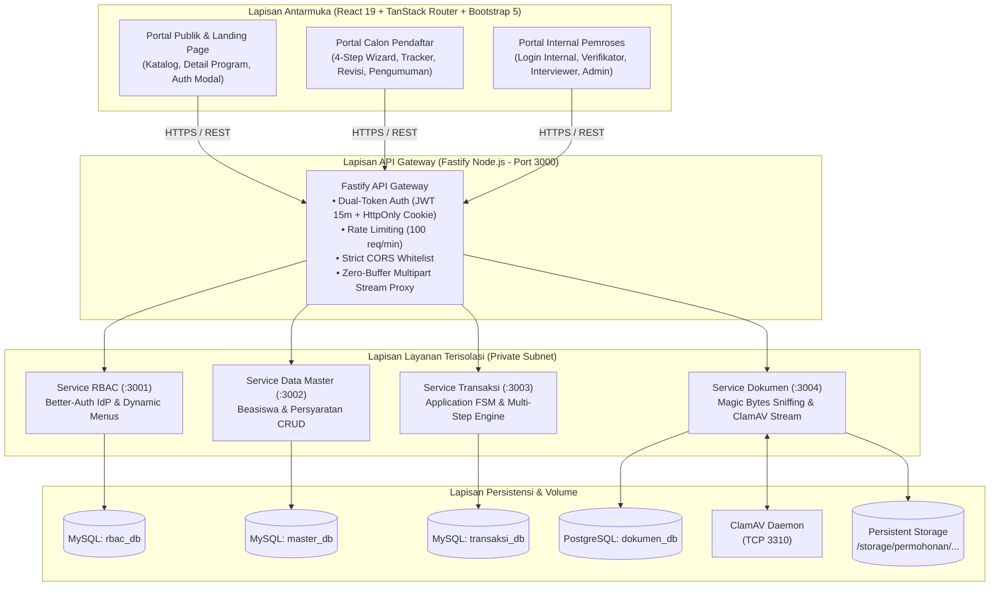
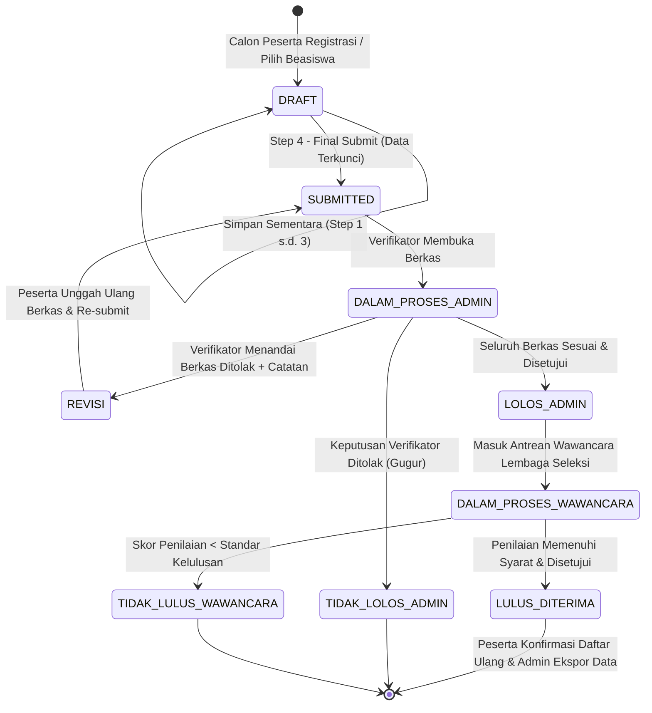
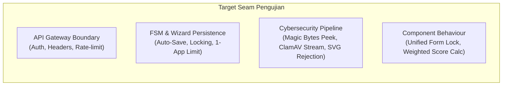

# Product Requirements Document (PRD): Sistem Pendaftaran & Seleksi Beasiswa Pelatihan

**Sistem:** Aplikasi Pendaftaran Beasiswa Pelatihan (`beasiswaapp`)  
**Dokumen Referensi Arsitektur:** [`docs/keputusan-arsitektur-dan-rekomendasi-teknis.md`](file:///D:/coding/beasiswaapp/docs/keputusan-arsitektur-dan-rekomendasi-teknis.md) & [`docs/arsitektur-dan-alur-sistem.md`](file:///D:/coding/beasiswaapp/docs/arsitektur-dan-alur-sistem.md)  
**Sumber Mockup:**  
- Calon Pendaftar: `C:\Users\Baiq\Downloads\2. MOCKUP\Calon Pendaftar` (`1_index.html` s.d. `6_index_lulus.html`)  
- Internal Pemroses: `C:\Users\Baiq\Downloads\2. MOCKUP\Internal` (`1_index_login.html` s.d. `4_index_admin.html`)  
**Status:** Ready for Implementation / Triage  
**Versi:** 1.0.0  

---

## 1. Problem Statement

Penyelenggaraan program beasiswa pelatihan kejuruan bersertifikat seringkali menghadapi kendala operasional yang signifikan pada skala pendaftaran massal:

1. **Beban Pengisian Berkas yang Melelahkan & Kerentanan Data Hilang (_Friction & Drop-off_):**
   Calon peserta dituntut mengunggah banyak dokumen identitas (KTP, KK, Ijazah, Surat Rekomendasi) dan mengisi data demografi yang panjang dalam satu kali duduk. Tanpa mekanisme penyimpanan parsial bertahap (_auto-save step wizard_) dan pemulihan sesi (_resume later_), gangguan koneksi atau penutupan peramban yang tidak disengaja mengakibatkan hilangnya seluruh data isian pendaftar, memicu frustrasi dan tingginya angka pembatalan pendaftaran (_abandonment rate_).
2. **Ketiadaan Transparansi Status & Kebingungan Pelamar:**
   Peserta seringkali tidak mengetahui apakah berkas mereka telah diterima, ditolak permanen, atau membutuhkan perbaikan dokumen spesifik. Tanpa antarmuka pelacakan status _real-time_ yang jelas, pelamar menghubungi panitia secara sporadis dan tidak terstruktur.
3. **Inefisiensi Koordinasi Tiga Pilar Pemroses Internal:**
   Proses seleksi melibatkan tiga peran berbeda yang bekerja berurutan: **Verifikator** (pemeriksaan berkas administratif), **Lembaga Seleksi Eksternal / Interviewer** (penilaian wawancara substantif), dan **Administrator** (pengambil keputusan kuota, penyedia data master, dan ekspor laporan). Tanpa pemisahan hak akses berbasis peran (_Dynamic RBAC_) dan mesin status terstandarisasi, terjadi kekacauan antrean kerja (_work in progress_), duplikasi review, dan potensi kebocoran data pribadi (IDOR/kebocoran NIK).
4. **Ancaman Keamanan Siber & Pemalsuan Dokumen:**
   Unggahan berkas pelamar rentan disalahgunakan melalui pemalsuan ekstensi file (misal berkas berbahaya yang dinamai `.pdf` atau `.jpg`), skrip injeksi berbahaya (SVG dengan payload XSS/XXE), serta serangan virus/malware langsung ke peladen aplikasi.

Solusi digital yang terstruktur, aman, terisolasi, dan berkinerja tinggi sangat diperlukan untuk menyelesaikan permasalahan di atas secara menyeluruh.

---

## 2. Solution Overview

Sistem **Aplikasi Pendaftaran Beasiswa Pelatihan** (`beasiswaapp`) menghadirkan portal terpadu berbasis web responsif untuk calon peserta dan tim internal pemroses, ditenagai oleh fondasi **Decoupled Microservices** berkinerja tinggi:



### Nilai Tambah Utama Solusi:
1. **Multi-Step Form Wizard dengan Auto-Save:** Formulir 4 tahap (Data Diri, Pendidikan/Kerja, Unggah Berkas, Persetujuan) yang menyimpan data seketika per langkah ke basis data dan memungkinkan pendaftar melanjutkan di lain waktu.
2. **Aturan Bisnis Ketat "1 Peserta = 1 Pendaftaran Aktif":** Mencegah peserta mengambil kuota ganda pada periode gelombang pelatihan yang sama.
3. **Pola Formulir Terpadu Tiga Kondisi (_Unified Form Pattern_):** Mengakomodasi formulir dalam kondisi dapat disunting penuh (`DRAFT`), terkunci total (_Read-Only_ saat `SUBMITTED`), dan dibuka kembali secara selektif khusus berkas yang ditolak (`REVISI`).
4. **Antarmuka Verifikator & Pewawancara Berbasis Kinerja:** Panel verifikasi dengan daftar periksa per-dokumen (_Sesuai / Ditolak_) dan kotak catatan perbaikan langsung, serta modul pewawancara dengan rubrik terbobot kalkulasi otomatis instan.
5. **Keamanan Siber Tanpa Kompromi:** Pemindaian antivirus _ClamAV_ via soket TCP `zINSTREAM`, pengecekan biner _Magic Bytes_ (4 KB peek), pelarangan SVG, penyimpanan terisolasi di luar web root beridentitas UUID acak, dan otentikasi _Dual-Token_ (JWT 15 menit + HttpOnly Cookie 7 hari).

---

## 3. End-to-End User Flows

### 3.1 Diagram Alur Siklus Hidup Pendaftaran (Finite State Machine)



### 3.2 Skenario Interaksi Utama (Happy Paths & Edge Cases)

#### Alur 1: Eksplorasi Publik & Pendaftaran Akun Peserta
- **Happy Path:**
  1. Pengunjung membuka URL `/` (Landing Page).
  2. Pengunjung melihat hero banner, daftar beasiswa aktif, persyaratan umum berkas (KTP, KK, Ijazah, Surat Rekomendasi, maks 2MB, PDF/JPG/PNG), serta alur pendaftaran.
  3. Pengunjung menekan tombol **"Lihat Detail & Daftar"** pada program (misal: "Pelatihan Web Developer Specialist").
  4. Modal detail program terbuka. Pengunjung menekan tombol **"Daftar Beasiswa Ini"**.
  5. Modal registrasi muncul meminta: NIK (16 digit), Nama Lengkap, dan Email Aktif.
  6. Setelah tombol submit ditekan, sistem membuat akun pengguna dengan peran `applicant`, membuat draf permohonan baru untuk beasiswa tersebut, mengirimkan kredensial sementara via email, dan mengarahkan pelamar ke dashboard pemohon `/applicant`.
- **Edge Cases & Penanganan Eror:**
  - *NIK sudah terdaftar:* Sistem menampilkan alert pesan eror bahwa NIK telah memiliki akun, dan menawarkan tautan langsung ke modal login.
  - *Email tidak valid:* Validasi Zod langsung menghentikan pengiriman form sebelum memanggil backend.
  - *Gelombang Pendaftaran Ditutup / Kuota Penuh:* Kartu program berstatus non-aktif (`5_index_ditutup.html`), tombol bertuliskan "Pendaftaran Ditutup" (disabled), dan sistem menolak inisiasi pendaftaran baru.

#### Alur 2: Pengisian Formulir Bertahap (4-Step Wizard) oleh Pelamar
- **Happy Path:**
  1. Pelamar masuk ke dashboard `/applicant` berstatus `DRAFT`.
  2. Menekan tombol **"Mulai Isi Formulir Pendaftaran"**; modal wizard fullscreen/XL terbuka pada Step 1.
  3. **Step 1 (Data Diri & Kontak):** Pelamar mengisi NIK, Nama Lengkap, Tempat Lahir, Tanggal Lahir, Jenis Kelamin, Alamat Domisili, Provinsi, Kab/Kota, Kecamatan, Kelurahan, No HP/WhatsApp, dan Email. Menekan **"Selanjutnya"** -> data divalidasi dan disimpan otomatis ke backend via `PUT /api/transaksi/pendaftaran/:id/step/1`.
  4. **Step 2 (Pendidikan & Pekerjaan):** Mengisi Pendidikan Terakhir, Nama Instansi/Kampus, Jurusan/Prodi, dan Pekerjaan Saat Ini. Menekan **"Selanjutnya"** -> tersimpan via `PUT /api/transaksi/pendaftaran/:id/step/2`.
  5. **Step 3 (Unggah Dokumen):** Mengunggah berkas KTP, KK, Ijazah Terakhir, dan Surat Rekomendasi (PDF/JPG/PNG, maks 2MB). Setiap file dialirkan ke `Service Dokumen`, diverifikasi _magic bytes_, dipindai _ClamAV_, dan disimpan dengan UUID acak.
  6. **Step 4 (Persetujuan & Submit):** Pelamar melihat ringkasan data, mencentang checkbox pernyataan kebenaran data, lalu menekan **"Kirim Pendaftaran (Submit)"**.
  7. Status pendaftaran beralih menjadi `SUBMITTED`. Formulir terkunci (_Read-Only_), dan dashboard menampilkan kartu monitoring dengan status "Proses Verifikasi".
- **Fitur Lanjut Nanti (_Resume Later_):**
  - Pelamar dapat menutup modal atau peramban kapan saja setelah menyelesaikan tahap tertentu.
  - Saat kembali login, sistem membaca atribut `step_wizard_terakhir` dan otomatis mengarahkan pelamar ke tahap terakhir yang belum diselesaikan.
- **Aturan 1 Pendaftaran Aktif:**
  - Begitu pelamar memiliki pendaftaran berstatus aktif (`DRAFT`, `SUBMITTED`, `DALAM_PROSES_ADMIN`, `REVISI`, `LOLOS_ADMIN`, `DALAM_PROSES_WAWANCARA`, `LULUS_DITERIMA`), kartu pelatihan lain pada katalog terkunci dengan tombol disabled bertuliskan: *"Batas Pendaftaran Tercapai (Anda sudah mendaftar pada pelatihan lain)"*.

#### Alur 3: Peninjauan Berkas oleh Verifikator & Penanganan Revisi
- **Happy Path (Disetujui):**
  1. Verifikator login via `/login` dan diarahkan ke `/verifikator`.
  2. Verifikator melihat metrik statistik (Perlu Verifikasi, Status Revisi, Disetujui, Ditolak) dan tabel antrean pendaftar.
  3. Menekan tombol **"Verifikasi Data"** pada peserta; modal verifikasi terbuka dengan 4 tab:
     - Tab 1: Data Diri & Kontak (Read-Only)
     - Tab 2: Pendidikan & Kerja (Read-Only)
     - Tab 3: Upload Dokumen (Tabel berkas dengan tombol pratinjau dokumen KTP, KK, Ijazah, Rekomendasi, toggle radio kesesuaian "Sesuai" / "Ditolak", dan input catatan perbaikan).
     - Tab 4: Checklist Pernyataan & Keputusan Akhir.
  4. Jika semua berkas sesuai, verifikator memilih status keputusan: **"Disetujui (Lolos Seleksi Administrasi)"** dan menekan submit. Status pendaftaran berubah menjadi `LOLOS_ADMIN` dan diteruskan ke Lembaga Seleksi.
- **Alternatif (Revisi Berkas):**
  1. Verifikator menemukan Ijazah buram/tidak terbaca. Verifikator menandai radio button Ijazah menjadi **"Ditolak"** dan mengisi catatan: *"Scan dokumen buram, mohon di-upload ulang dengan jelas."*
  2. Pada Tab 4, verifikator memilih status keputusan **"Revisi (Harus Perbaikan Berkas)"** dan menyertakan instruksi umum, lalu menekan submit.
  3. Status pendaftaran berubah menjadi `REVISI`.
  4. Pelamar menerima pembaruan di dashboard: status bertuliskan "Revisi Berkas" dan tombol tindakan berubah menjadi **"Perbaiki Data"** (kuning).
  5. Saat pelamar membuka wizard, berkas yang sah tetap terkunci, sedangkan berkas Ijazah terbuka kembali dengan alert catatan verifikator. Pelamar mengunggah ulang ijazah baru dan menekan **"Kirim Pendaftaran (Submit)"**. Status kembali menjadi `SUBMITTED` dan masuk ke antrean verifikator dengan label *"Hasil Revisi"*.
- **Alternatif (Ditolak Permanen):**
  1. Verifikator menetapkan berkas palsu/tidak memenuhi kriteria dasar. Memilih status **"Ditolak (Gugur Administrasi)"**. Status berubah menjadi `TIDAK_LOLOS_ADMIN`. Alur peserta berakhir.

#### Alur 4: Seleksi Wawancara oleh Lembaga Seleksi (Interviewer)
- **Happy Path:**
  1. Pewawancara login via `/login` memilih peran Lembaga Seleksi, diarahkan ke `/wawancara`.
  2. Meninjau daftar peserta yang telah berstatus `LOLOS_ADMIN`.
  3. Menekan tombol **"Input Penilaian"** (atau **"Edit Nilai"**); modal penilaian wawancara terbuka.
  4. Menampilkan kartu identitas peserta dan dua seksi penilaian:
     - **Seksi 1 (Skor Terbobot 0 - 100):**
       - Komunikasi & Sikap (Bobot 30%)
       - Pemahaman Teknis & Motivasi (Bobot 40%)
       - Komitmen & Kehadiran Pelatihan (Bobot 30%)
       - *Nilai Akhir dikalkulasi otomatis secara instan:*  
         $$\text{Nilai Akhir} = (K \times 0.3) + (T \times 0.4) + (M \times 0.3)$$
     - **Seksi 2 (Keputusan & Catatan):**
       - Dropdown Status Wawancara: "Lulus Wawancara" atau "Tidak Lulus Wawancara".
       - Catatan / Executive Summary Evaluasi (textarea).
  5. Pewawancara menekan **"Submit Hasil Wawancara"**.
  6. Jika lulus, status pendaftaran menjadi `LULUS_DITERIMA`. Jika tidak lulus, status menjadi `TIDAK_LULUS_WAWANCARA`.

#### Alur 5: Pengumuman Kelulusan & Konfirmasi Daftar Ulang Pelamar
- **Happy Path:**
  1. Pelamar berstatus `LULUS_DITERIMA` masuk ke dashboard `/applicant` (`6_index_lulus.html`).
  2. Tampil banner hijau ucapan selamat: *"Selamat, Yosep Rohayadi! Anda dinyatakan LULUS SELEKSI..."*.
  3. Pelamar dapat menekan tombol **"Unduh Surat Kelulusan (PDF)"** untuk mengunduh SK resmi berformat PDF.
  4. Pelamar menekan **"Konfirmasi / Daftar Ulang"**; modal konfirmasi muncul.
  5. Pelamar memilih status kesediaan ("Ya, Saya Bersedia Mengikuti Pelatihan" atau "Saya Mengundurkan Diri"), menulis catatan opsional, lalu menekan **"Kirim Konfirmasi"**.
  6. Pelamar membaca panduan langkah selanjutnya (bergabung grup koordinasi WhatsApp/Telegram dan jadwal orientasi pembukaan).

#### Alur 6: Monitoring, Master Data & Pengaturan oleh Administrator
- **Happy Path:**
  1. Administrator login ke `/admin`.
  2. **Tab Dashboard:** Memantau metrik agregat (Total Pendaftar, Proses Administrasi, Lolos Administrasi, Gugur Administrasi, Proses Wawancara, Lulus Wawancara, Gagal Wawancara).
  3. **Tab Hasil Seleksi:** Melihat rekap kelulusan lengkap peserta dan menekan tombol hijau **"Export Excel"** untuk mengunduh berkas `.xlsx` hasil seleksi.
  4. **Tab Data Master:**
     - Sub-tab CRUD Beasiswa: Menambah, mengubah kuota, metode (Daring/Hybrid/Luring), dan menutup pendaftaran beasiswa.
     - Sub-tab CRUD Persyaratan: Mengelola dokumen wajib/opsional, batas ukuran (maks 2MB), dan format berkas.
  5. **Tab Setting System:**
     - Mengelola akun staf internal (Verifikator, Lembaga Seleksi, Admin).
     - Mengelola Role dan hak akses menu dinamis.
     - Mengatur hierarki menu sistem.

---

## 4. User Stories

### 4.1 Calon Peserta (Applicant)
1. **US-01:** As a calon peserta, I want to menjelajahi katalog beasiswa pelatihan aktif di halaman beranda, so that saya dapat mengetahui program pelatihan yang sesuai dengan kualifikasi dan minat saya.
2. **US-02:** As a calon peserta, I want to membaca detail program, persyaratan khusus, dan dokumen yang wajib diunggah dalam jendela modal, so that saya dapat mempersiapkan seluruh berkas sebelum mendaftar.
3. **US-03:** As a calon peserta, I want to mendaftarkan akun baru menggunakan NIK, nama lengkap, dan email aktif, so that saya memperoleh kredensial akun dan dapat memulai proses pendaftaran.
4. **US-04:** As a calon peserta, I want to mengisi formulir pendaftaran melalui wizard bertahap 4 langkah (Data Diri, Pendidikan/Kerja, Berkas, Persetujuan), so that proses pengisian formulir terstruktur dan tidak membingungkan.
5. **US-05:** As a calon peserta, I want to data formulir saya tersimpan otomatis saat menekan tombol "Selanjutnya" di setiap tahap, so that progres pengisian saya tidak hilang saat terjadi gangguan koneksi atau keluar sesi.
6. **US-06:** As a calon peserta, I want to dapat mengunggah berkas KTP, KK, Ijazah, dan Rekomendasi dalam format PDF/JPG/PNG maksimal 2MB per file, so that berkas saya dapat diverifikasi keabsahannya oleh tim panitia.
7. **US-07:** As a calon peserta, I want to sistem membatasi pendaftaran saya hanya pada 1 program beasiswa aktif, so that alokasi kuota pendaftaran adil bagi seluruh peserta lainnya.
8. **US-08:** As a calon peserta, I want to mencentang lembar persetujuan keabsahan data sebelum melakukan submit final, so that saya terikat secara hukum terhadap data yang saya berikan.
9. **US-09:** As a calon peserta, I want to melihat status monitoring pendaftaran saya dan meninjau data terkirim dalam mode baca saja (read-only), so that saya dapat memastikan data yang telah terkunci tidak berubah selama proses verifikasi.
10. **US-10:** As a calon peserta, I want to menerima notifikasi revisi dan catatan verifikator jika terdapat berkas yang ditolak, so that saya dapat mengunggah ulang hanya dokumen yang salah tanpa harus mengisi ulang data diri dari awal.
11. **US-11:** As a calon peserta, I want to melihat banner pengumuman kelulusan dan mengunduh Surat Keterangan Kelulusan resmi berbentuk PDF, so that saya memiliki bukti kelulusan seleksi yang sah.
12. **US-12:** As a calon peserta, I want to melakukan konfirmasi kehadiran/daftar ulang secara online, so that panitia dapat mengamankan kursi pelatihan saya.

### 4.2 Verifikator Administrasi (Verifikator)
13. **US-13:** As a verifikator, I want to masuk ke portal internal verifikator dan melihat ringkasan statistik antrean berkas (Perlu Verifikasi, Revisi, Lolos, Ditolak), so that saya dapat memprioritaskan beban kerja harian secara efisien.
14. **US-14:** As a verifikator, I want to melihat tabel daftar pendaftar lengkap dengan label "Baru Submit" atau "Hasil Revisi", so that saya dapat membedakan berkas baru dan berkas yang telah diperbaiki peserta.
15. **US-15:** As a verifikator, I want to memeriksa rincian data diri, riwayat pendidikan, dan membuka pratinjau dokumen (PDF/Gambar) peserta, so that saya dapat mencocokkan keaslian data dengan berkas yang dilampirkan.
16. **US-16:** As a verifikator, I want to menandai status kesesuaian setiap berkas secara individual (Sesuai atau Ditolak) serta menyematkan catatan perbaikan spesifik, so that pelamar memahami persis bagian berkas yang perlu diperbaiki.
17. **US-17:** As a verifikator, I want to menetapkan keputusan akhir administrasi (Disetujui/Lolos, Revisi, atau Ditolak/Gugur) beserta catatan umum, so that berkas dapat berpindah ke tahap berikutnya sesuai aturan FSM.

### 4.3 Lembaga Seleksi (Interviewer)
18. **US-18:** As a pewawancara, I want to melihat daftar calon peserta yang telah dinyatakan lolos seleksi administrasi, so that saya dapat melakukan penjadwalan dan proses wawancara.
19. **US-19:** As a pewawancara, I want to memasukkan nilai komponen wawancara (Komunikasi & Sikap 30%, Pemahaman Teknis 40%, Komitmen 30%) pada skala 0 - 100, so that penilaian terstandarisasi dan objektif.
20. **US-20:** As a pewawancara, I want to nilai akhir terhitung secara otomatis berdasarkan bobot persentase, so that saya terhindar dari kesalahan kalkulasi manual.
21. **US-21:** As a pewawancara, I want to memperbarui status kelulusan wawancara ("Lulus Wawancara" atau "Tidak Lulus") disertai ringkasan evaluasi, so that keputusan akhir seleksi terdokumentasi dengan baik.

### 4.4 Administrator System (Admin)
22. **US-22:** As an administrator, I want to melihat dasbor analitik lengkap sebaran status seleksi dari tahap pendaftaran hingga final, so that saya memiliki visibilitas penuh atas operasional program beasiswa.
23. **US-23:** As an administrator, I want to mengekspor rekapitulasi data hasil seleksi ke format spreadsheet Excel (.xlsx), so that laporan resmi dapat diserahkan ke pihak pimpinan dan instansi pembina.
24. **US-24:** As an administrator, I want to mengelola master data program beasiswa pelatihan (tambah, ubah kuota, ubah metode online/hybrid/offline, buka/tutup pendaftaran), so that jadwal gelombang pendaftaran selalu akurat.
25. **US-25:** As an administrator, I want to mengelola master data persyaratan dokumen (nama berkas, tipe berkas diizinkan, batas ukuran, mandatory/opsional), so that kriteria seleksi dapat disesuaikan per program pelatihan.
26. **US-26:** As an administrator, I want to mengelola akun pengguna internal pemroses dan hak akses menu dinamis berbasis RBAC, so that setiap staf hanya memiliki akses sesuai kewenangan jabatannya.

---

## 5. Implementation Decisions & Frontend UI Component Architecture

### 5.1 Keselarasan Desain UI & Bootstrap 5
Sesuai mandat pengguna:
- **Tampilan UI wajib identik 100% dengan Mockup HTML** yang disediakan pada folder `Calon Pendaftar` dan `Internal`.
- Seluruh elemen antarmuka, dialog, modal, tabel, dan formulir diekstraksi ke dalam **komponen React modular** (`apps/web/src/components/...`).
- Tata letak menggunakan **Bootstrap 5.3** dan **Bootstrap Icons (`bi-*`)** yang terkonfigurasi konsisten dengan palet warna mockup:
  - Biru Primer: `#0d6efd` (Navbar, Header modal, Tombol utama, Hero background)
  - Hijau Sukses: `#198754` (Lolos, Banner kelulusan, Tombol Submit & Excel)
  - Kuning/Oranye Peringatan: `#ffc107` / `#fd7e14` (Revisi, Tombol perbaiki data)
  - Merah Bahaya: `#dc3545` (Ditolak, Pendaftaran ditutup)
  - Abu-abu Terang: `#f8f9fa` (Latar belakang halaman & kartu disabled)

---

### 5.2 Struktur Routing Halaman (TanStack Router)

Struktur rute pada `apps/web/src/routes` dipetakan secara bersih sesuai domain pengguna:

```text
apps/web/src/routes/
├── __root.tsx                                  # Root Layout (Bootstrap CSS, Icons, Sonner Toaster)
├── index.tsx                                   # [1_index.html] Landing Page Publik & Katalog Beasiswa
├── login.tsx                                   # [1_index_login.html] Login Pemroses Internal (Verifikator, Interviewer, Admin)
│
├── applicant/                                  # Rute Terproteksi Calon Peserta (Role: applicant)
│   ├── _layout.tsx                             # Top Navbar Applicant (User Dropdown, Logout)
│   ├── index.tsx                               # Dashboard Status Pelamar:
│   │                                           # - Kondisi DRAFT (2_index_awal.html)
│   │                                           # - Kondisi SUBMITTED (3_index_terkirim.html)
│   │                                           # - Kondisi REVISI (4_index_revisi.html)
│   │                                           # - Kondisi DITUTUP (5_index_ditutup.html)
│   │                                           # - Kondisi LULUS (6_index_lulus.html)
│   └── pendaftaran/
│       └── $pendaftaranId/
│           ├── route.tsx                       # Layout Wizard & Resume-Later Resolver
│           ├── step-1.tsx                      # Bagian 1: Data Diri & Kontak
│           ├── step-2.tsx                      # Bagian 2: Pendidikan & Pekerjaan
│           ├── step-3.tsx                      # Bagian 3: Unggah Dokumen Pendukung
│           └── step-4.tsx                      # Bagian 4: Lembar Persetujuan & Final Submit
│
├── verifikator/                                # Rute Terproteksi Verifikator (Role: verifikator)
│   ├── _layout.tsx                             # Sidebar Biru Verifikator & Topbar
│   └── index.tsx                               # [2_index_verifikator.html] Antrean Verifikasi & Modal Review
│
├── wawancara/                                  # Rute Terproteksi Lembaga Seleksi (Role: interviewer)
│   ├── _layout.tsx                             # Sidebar Biru Lembaga Seleksi & Topbar
│   └── index.tsx                               # [3_index_wawancara.html] Proses Wawancara & Modal Penilaian
│
└── admin/                                      # Rute Terproteksi Administrator (Role: admin, superadmin)
    ├── _layout.tsx                             # Sidebar Biru Admin & Topbar
    ├── index.tsx                               # [4_index_admin.html - Tab 1] Dashboard Statistik Ringkasan
    ├── hasil.tsx                               # [4_index_admin.html - Tab 2] Hasil Seleksi & Export Excel
    ├── master/
    │   ├── beasiswa.tsx                        # [4_index_admin.html - Tab 3A] CRUD Beasiswa Pelatihan
    │   └── persyaratan.tsx                     # [4_index_admin.html - Tab 3B] CRUD Persyaratan Dokumen
    └── setting/
        ├── users.tsx                           # [4_index_admin.html - Tab 4A] CRUD Users Internal
        ├── roles.tsx                           # [4_index_admin.html - Tab 4B] CRUD Role & Hak Akses Menu
        └── menus.tsx                           # [4_index_admin.html - Tab 4C] CRUD Menu System
```

---

### 5.3 Taksonomi & Dekomposisi Komponen React

Untuk memastikan kode bersih, modular, dan mematuhi kaidah DRY (_Don't Repeat Yourself_), antarmuka dipecah menjadi modul-modul komponen berikut:

#### 1. Komponen Tata Letak & Navigasi (`components/layout/`)
- `NavbarPublic`: Navbar sticky portal publik dengan logo BeasiswaApp, navigasi anchor (`#home`, `#program`, `#persyaratan`, `#alur`), serta tombol pemicu `LoginModal` dan `RegisterModal`.
- `NavbarApplicant`: Navbar peserta dengan identitas nama pengguna login dan dropdown logout.
- `SidebarInternal`: Navigasi samping berwarna biru gradient (`#0d6efd` ke `#0a58ca`) dengan menu dinamis sesuai role aktif (Verifikator, Lembaga Seleksi, Admin) dan tombol logout.
- `PageHeaderInternal`: Banner judul halaman internal dengan badge identitas petugas pemroses.

#### 2. Komponen Kartu & Indikator Status (`components/cards/`)
- `StatCard`: Kartu ringkasan metrik statistik interaktif dengan efek transisi melayang (`card-stat:hover`), icon Bootstrap, judul, dan angka hitungan (misal: "Perlu Verifikasi: 12", "Lolos: 48"). Mendukung varian warna: `primary`, `info`, `success`, `warning`, `danger`, `secondary`.
- `ProgramCard`: Kartu program pelatihan pada katalog publik & peserta. Mendukung 3 status:
  - *Aktif:* Menampilkan kuota, metode, deadline, dan tombol "Lihat Detail & Daftar".
  - *Program Pilihan Anda:* Border biru tebal dan tombol "Lihat / Edit Form Pendaftaran".
  - *Terkunci / Batas Tercapai:* Kelas `.card-disabled` atau `.card-closed`, badge secondary/danger, dan tombol disabled.
- `StatusBadge`: Komponen pemetaan status FSM pendaftaran ke format badge semantik:
  - `DRAFT`: Badge abu-abu `Draft Belum Dikirim`
  - `SUBMITTED`: Badge info `Proses Verifikasi`
  - `REVISI`: Badge kuning `Revisi Berkas`
  - `TIDAK_LOLOS_ADMIN`: Badge merah `Gugur Administrasi`
  - `LOLOS_ADMIN`: Badge hijau `Lolos Administrasi`
  - `DALAM_PROSES_WAWANCARA`: Badge oranye `Proses Wawancara`
  - `TIDAK_LULUS_WAWANCARA`: Badge merah `Tidak Lulus`
  - `LULUS_DITERIMA`: Badge hijau `DITERIMA (LULUS)`

#### 3. Modal & Dialog Calon Peserta (`components/modals/applicant/`)
- `LoginModal`: Modal login peserta (Email/Username, Kata Sandi, submit pendaftaran).
- `RegisterModal`: Modal pendaftaran akun baru peserta (NIK 16 digit, Nama Lengkap, Email Aktif, link ke LoginModal).
- `ProgramDetailModal`: Modal detail beasiswa (Deskripsi materi, Persyaratan khusus, Dokumen wajib, tombol daftar).
- `WizardModal`: Modal ukuran XL (`modal-xl modal-dialog-scrollable`, static backdrop) yang membungkus 4-step wizard form lengkap dengan navigasi tab dan kontrol tombol Kembali, Simpan Draft, Selanjutnya, dan Submit.
- `WizardReadonlyModal`: Modal baca saja (`3_index_terkirim.html`) dengan alert info peringatan dan input disabled untuk meninjau data yang sedang diverifikasi.
- `DaftarUlangModal`: Modal konfirmasi kehadiran/daftar ulang kelulusan (`6_index_lulus.html`) dengan select opsi kesediaan ("Ya, Saya Bersedia" / "Mengundurkan Diri") dan textarea catatan tambahan.
- `FilePreviewModal`: Modal pembaca berkas terproteksi (viewer PDF & gambar JPG/PNG dengan kontrol zoom/rotasi).

#### 4. Komponen Formulir Step Wizard (`components/forms/wizard/`)
- `Step1BiodataForm`: Form Bagian 1 (NIK, Nama Lengkap, Tempat/Tgl Lahir, Jenis Kelamin, Alamat, Wilayah Cascading: Provinsi, Kab/Kota, Kecamatan, Kelurahan, No HP/WA, Email).
- `Step2PendidikanForm`: Form Bagian 2 (Jenjang Pendidikan Terakhir, Nama Instansi/Kampus, Jurusan/Program Studi, Status Pekerjaan Saat Ini).
- `Step3DokumenForm`: Form Bagian 3 (Unggah KTP, KK, Ijazah, Surat Rekomendasi). Dilengkapi indikator berkas terunggah, tautan pratinjau, serta pesan peringatan revisi verifikator jika berkas ditolak.
- `Step4PersetujuanForm`: Form Bagian 4 (Kartu ringkasan data pendaftar, alert ketentuan, dan checkbox pernyataan keabsahan fakta).
- `WizardStepperHeader`: Bilah navigasi 4 langkah di bagian atas modal wizard dengan kelas `.active` dan `.completed`.

#### 5. Modal & Formulir Internal Pemroses (`components/modals/internal/`)
- `VerifikasiModal`: Modal verifikasi 4 tab bagi Verifikator (`2_index_verifikator.html`):
  - Tab 1 & 2: Biodata & Riwayat Pendidikan peserta (read-only box).
  - Tab 3: Tabel periksa dokumen dengan tombol "Pratinjau [Berkas]", radio button toggle button group ("Sesuai" hijau vs "Ditolak" merah), dan input text "Catatan Perbaikan Verifikator".
  - Tab 4: Verifikasi persetujuan peserta, dropdown Keputusan Akhir ("Disetujui", "Revisi", "Ditolak"), dan textarea catatan resmi verifikator.
- `WawancaraModal`: Modal penilaian bagi Lembaga Seleksi (`3_index_wawancara.html`):
  - Banner identitas pendaftar (Nama, NIK, Program, Status lolos admin).
  - Seksi 1: Tiga input nilai angka (0 - 100) untuk Komunikasi & Sikap (30%), Pemahaman Teknis (40%), dan Komitmen (30%), dengan kotak kalkulasi otomatis "Nilai Akhir" (readonly, warna biru tebal).
  - Seksi 2: Dropdown Keputusan Wawancara ("Lulus Wawancara" / "Tidak Lulus") dan textarea evaluasi naratif.
- `AddBeasiswaModal` / `EditBeasiswaModal`: Modal formulir CRUD Beasiswa Pelatihan (Nama program, Kuota peserta, Metode daring/hybrid/luring, Tanggal periode).
- `AddPersyaratanModal` / `EditPersyaratanModal`: Modal formulir CRUD Persyaratan (Nama dokumen, Tipe berkas, Ukuran maks, Status mandatory).
- `AddUserInternalModal` / `EditUserInternalModal`: Modal manajemen akun staf internal (Nama, Email, Role, Status aktif).
- `RoleMenuPermissionModal`: Modal matriks konfigurasi hak akses menu dinamis per role (Checklist izin View, Create, Update, Delete).

---

### 5.4 Spesifikasi Kontrak API & Modul Backend

Sesuai arsitektur *Database-per-Service*, berikut daftar kontrak endpoint pada Fastify API Gateway (`:3000`):

#### A. Service RBAC (`/api/auth` & `/api/rbac`)
- `POST /api/auth/sign-up/applicant`: Registrasi akun peserta baru.
- `POST /api/auth/sign-in`: Login peserta dan staf internal (menerbitkan JWT 15 menit & HttpOnly Refresh Cookie).
- `POST /api/auth/token`: Silent refresh token JWT.
- `POST /api/auth/sign-out`: Menghapus cookie sesi.
- `GET /api/rbac/users`: Mengambil daftar akun staf internal (Admin only).
- `POST /api/rbac/users`: Menambah akun staf internal.
- `GET /api/rbac/roles`: Mengambil daftar role sistem.
- `GET /api/rbac/menus`: Mengambil hierarki menu navigasi dinamis.
- `GET /api/rbac/me/menus`: Mengambil menu khusus untuk role pengguna yang sedang login.

#### B. Service Data Master (`/api/master`)
- `GET /api/master/beasiswa`: Publik / Authenticated. Katalog beasiswa aktif beserta kuota dan tanggal.
- `GET /api/master/beasiswa/:id`: Detail spesifik beasiswa dan daftar persyaratan berkasnya.
- `POST /api/master/beasiswa`: Admin only. Tambah beasiswa pelatihan baru.
- `PUT /api/master/beasiswa/:id`: Admin only. Perbarui informasi beasiswa.
- `DELETE /api/master/beasiswa/:id`: Admin only. Soft-delete beasiswa pelatihan.
- `GET /api/master/persyaratan`: Daftar master persyaratan dokumen.
- `POST /api/master/persyaratan`: Admin only. Tambah master persyaratan baru.

#### C. Service Transaksi (`/api/transaksi`)
- `GET /api/transaksi/pendaftaran/my-active`: Mengambil 1 pendaftaran aktif pelamar login (menentukan status: DRAFT, SUBMITTED, REVISI, LULUS, dll.).
- `POST /api/transaksi/pendaftaran/init`: Inisiasi pendaftaran baru untuk beasiswa tertentu (membuat record DRAFT).
- `PUT /api/transaksi/pendaftaran/:id/step/1`: Simpan instan Bagian 1 (Biodata & Kontak).
- `PUT /api/transaksi/pendaftaran/:id/step/2`: Simpan instan Bagian 2 (Pendidikan & Pekerjaan).
- `PUT /api/transaksi/pendaftaran/:id/step/3`: Simpan instan Bagian 3 (Metadata tautan dokumen).
- `POST /api/transaksi/pendaftaran/:id/submit`: Step 4 Final Submit (Memvalidasi checklist keabsahan, mengunci status menjadi `SUBMITTED`, mencatat snapshot data historis).
- `GET /api/transaksi/verifikasi/queue`: Antrean pendaftar untuk Verifikator (`Baru Submit` & `Hasil Revisi`).
- `GET /api/transaksi/verifikasi/:pendaftaranId`: Detail lengkap data peserta untuk modal verifikasi.
- `POST /api/transaksi/verifikasi/:pendaftaranId/decision`: Submit hasil verifikasi administrasi (Disetujui, Revisi dengan catatan, atau Ditolak).
- `GET /api/transaksi/wawancara/queue`: Antrean peserta lolos administrasi untuk Lembaga Seleksi.
- `POST /api/transaksi/wawancara/:pendaftaranId/scoring`: Submit skor 3 komponen dan keputusan wawancara.
- `POST /api/transaksi/pendaftaran/:id/daftar-ulang`: Submit konfirmasi kehadiran/daftar ulang peserta lulus.
- `GET /api/transaksi/admin/statistics`: Agregasi metrik hitungan status untuk dasbor admin.
- `GET /api/transaksi/admin/export-excel`: Unduh berkas rekapitulasi kelulusan format `.xlsx`.

#### D. Service Dokumen (`/api/dokumen`)
- `POST /api/dokumen/upload`:
  - Menerima aliran `multipart/form-data` dari gateway tanpa disk buffering.
  - Membaca 4 KB pertama aliran byte untuk verifikasi _magic bytes_ (`PDF`, `JPG`, `PNG`).
  - Mengalirkan stream ke ClamAV daemon (`TCP 3310: zINSTREAM`).
  - Jika bersih, menulis ke `/storage/permohonan/{kode_permohonan}/{persyaratan_id}_{uuid}.{ext}`.
  - Menyimpan metadata ke PostgreSQL `dokumen_db` dan mengembalikan UUID dokumen.
- `GET /api/dokumen/:uuid/stream`:
  - Endpoint streaming terproteksi Anti-IDOR.
  - Memeriksa apakah token pengguna adalah pemilik berkas atau verifikator/interviewer/admin.
  - Mengalirkan biner berkas dengan header `X-Content-Type-Options: nosniff` dan `Content-Security-Policy: default-src 'none'; sandbox`.

---

### 5.5 Struktur Tipe Data Bersama (`packages/contracts`)

```typescript
// packages/contracts/src/enums/status.ts
export const ApplicationStatus = {
  DRAFT: "DRAFT",
  SUBMITTED: "SUBMITTED",
  DALAM_PROSES_ADMIN: "DALAM_PROSES_ADMIN",
  REVISI: "REVISI",
  TIDAK_LOLOS_ADMIN: "TIDAK_LOLOS_ADMIN",
  LOLOS_ADMIN: "LOLOS_ADMIN",
  DALAM_PROSES_WAWANCARA: "DALAM_PROSES_WAWANCARA",
  TIDAK_LULUS_WAWANCARA: "TIDAK_LULUS_WAWANCARA",
  LULUS_DITERIMA: "LULUS_DITERIMA",
} as const;

export type ApplicationStatus = typeof ApplicationStatus[keyof typeof ApplicationStatus];

// packages/contracts/src/schemas/wizard.ts
import { z } from "zod";

export const step1BiodataSchema = z.object({
  nik: z.string().length(16, "NIK wajib 16 digit angka").regex(/^\d{16}$/, "Hanya boleh angka"),
  namaLengkap: z.string().min(3, "Nama lengkap minimal 3 karakter"),
  tempatLahir: z.string().min(2, "Tempat lahir wajib diisi"),
  tglLahir: z.string().regex(/^\d{4}-\d{2}-\d{2}$/, "Format tanggal YYYY-MM-DD"),
  jenisKelamin: z.enum(["L", "P"], { message: "Pilih jenis kelamin" }),
  alamat: z.string().min(10, "Alamat domisili minimal 10 karakter"),
  provinsi: z.string().min(1, "Provinsi wajib dipilih"),
  kabupatenKota: z.string().min(1, "Kabupaten/Kota wajib dipilih"),
  kecamatan: z.string().min(1, "Kecamatan wajib dipilih"),
  kelurahan: z.string().min(1, "Kelurahan wajib dipilih"),
  noHp: z.string().min(10).max(15).regex(/^[0-9+]+$/, "Nomor HP tidak valid"),
  email: z.string().email("Format email tidak valid"),
});

export const step2PendidikanSchema = z.object({
  pendidikanTerakhir: z.enum(["SMA/SMK Sederajat", "D3 / D4", "S1 (Sarjana)", "S2 / S3"]),
  namaInstansi: z.string().min(3, "Nama instansi minimal 3 karakter"),
  jurusan: z.string().min(2, "Jurusan minimal 2 karakter"),
  pekerjaanSaatIni: z.string().min(2, "Pekerjaan saat ini minimal 2 karakter"),
});

export const step3DokumenItemSchema = z.object({
  persyaratanId: z.string().min(1),
  dokumenId: z.string().uuid(),
  fileNameOriginal: z.string().min(1),
  catatanRevisi: z.string().optional(),
});

export const step4PersetujuanSchema = z.object({
  pernyataanKeabsahan: z.literal(true, {
    message: "Anda wajib menyetujui pernyataan kebenaran data & dokumen",
  }),
});

// packages/contracts/src/schemas/verifikasi.ts
export const verifikasiDecisionSchema = z.object({
  statusKeputusan: z.enum(["disetujui", "revisi", "ditolak"]),
  catatanVerifikator: z.string().min(5, "Catatan verifikator wajib diisi"),
  dokumenChecklist: z.array(
    z.object({
      persyaratanId: z.string(),
      isSesuai: z.boolean(),
      catatanPerbaikan: z.string().optional(),
    })
  ),
});

// packages/contracts/src/schemas/wawancara.ts
export const wawancaraScoringSchema = z.object({
  skorKomunikasi: z.number().min(0).max(100),
  skorTeknis: z.number().min(0).max(100),
  skorKomitmen: z.number().min(0).max(100),
  statusWawancara: z.enum(["Lulus", "Tidak Lulus"]),
  catatanEvaluasi: z.string().min(5, "Catatan evaluasi wajib diisi"),
});
```

---

## 6. Testing Decisions

### 6.1 Batasan Pengujian & Strategi Seam
Pengujian difokuskan pada pengujian perilaku eksternal (_observable behavior_) pada lapisan kritis:



### 6.2 Skenario Uji Kunci (Key Test Scenarios)

1. **Wizard Multi-Step & Resume-Later:**
   - Menyimpan Step 1 dengan data valid -> merespons HTTP 200 dan mengembalikan `step_wizard_terakhir: 1`.
   - Mengakses pendaftaran kembali -> resolver rute otomatis mengarahkan ke Step 2.
   - Melakukan submit pada Step 4 tanpa mencentang checkbox keabsahan -> ditolak validasi Zod HTTP 400.
   - Melakukan submit Step 4 sukses -> status beralih ke `SUBMITTED`, mutasi data selanjutnya pada Step 1 s.d. 3 ditolak HTTP 403 (Status Terkunci).
2. **Aturan Bisnis "1 Peserta 1 Pendaftaran Aktif":**
   - Peserta yang memiliki pendaftaran aktif memanggil `POST /api/transaksi/pendaftaran/init` untuk program lain -> sistem menolak dengan HTTP 422 dan pesan: *"Batas pendaftaran tercapai. Anda telah terdaftar pada program aktif."*
3. **Pipeline Keamanan Dokumen:**
   - Unggah file ber-ekstensi `.pdf` namun berisi header biner teks palsu -> ditolak oleh `file-type` magic bytes sniffing dengan HTTP 400 Bad Request.
   - Unggah file gambar format `.svg` (`image/svg+xml`) -> ditolak mutlak HTTP 400 (Larangan SVG).
   - Unggah file uji standar EICAR string -> terdeteksi oleh `MockAntivirusScanner` / ClamAV -> diisolasi & ditolak HTTP 422 Unprocessable Content.
4. **Verifikasi Seleksi & Mode Revisi:**
   - Verifikator mengubah status menjadi `revisi` dengan 1 dokumen ditolak -> status pendaftaran menjadi `REVISI`.
   - Saat peserta memuat ulang form, bidang input dokumen yang ditolak berstatus `disabled={false}` dengan alert catatan verifikator, sedangkan berkas yang sah berstatus `disabled={true}`.
5. **Kalkulasi Otomatis Skor Wawancara:**
   - Input nilai: Komunikasi = 85, Teknis = 88, Komitmen = 90.
   - UI dan backend memverifikasi kalkulasi: $(85 \times 0.3) + (88 \times 0.4) + (90 \times 0.3) = 25.5 + 35.2 + 27.0 = 87.70$.
6. **Proteksi Anti-IDOR:**
   - Peserta A mencoba mengakses URL stream berkas milik Peserta B via `GET /api/dokumen/:id/stream` -> Gateway/Service Dokumen menolak dengan HTTP 403 Forbidden.

---

## 7. Out of Scope

Fitur dan konfigurasi berikut secara eksplisit berada di luar cakupan rilis ini:
1. **Pelaksanaan Ujian Tertulis / CBT (Computer Based Test) Online:** Seleksi tahap 1 hanya bersifat administrasi berkas. Sistem tidak mengelola bank soal atau ujian daring.
2. **Video Conference Tersemat (Embedded Video Call):** Wawancara dilaksanakan tatap muka atau melalui tautan pertemuan eksternal (Google Meet/Zoom). Sistem hanya mencatat input nilai dan evaluasi hasil wawancara.
3. **Sistem Pembayaran / Disbursmen Dana Uang Saku:** Seluruh program beasiswa berbiaya 100% gratis; tidak ada integrasi _Payment Gateway_.
4. **Mobile Native App (iOS/Android):** Aplikasi dibangun sebagai _Responsive Web Application_ (Mobile-first browser support) tanpa APK/IPA native.
5. **Pengeditan Format Sertifikat Pelatihan Otomatis:** Sistem menerbitkan Surat Keterangan Kelulusan (SK) berformat PDF standar, namun tidak mencetak sertifikat kompetensi pelatihan akhir.

---

## 8. Further Notes

### 8.1 Pertimbangan Keamanan Siber (Cybersecurity Standards)
- **Header Keamanan Ekstraksi Berkas:** Setiap penyajian berkas streaming wajib menyematkan:
  - `X-Content-Type-Options: nosniff`
  - `Content-Security-Policy: default-src 'none'; sandbox`
  - `Cache-Control: private, no-cache, no-store, must-revalidate`
- **Sanitasi XSS Frontend & Backend:** Menggunakan auto-escaping bawaan JSX React 19 dan pustaka sanitasi string pada backend untuk input nama domisili dan catatan evaluasi.
- **Throttling & Rate-Limiting:** Fastify API Gateway menerapkan batas 100 request/menit per IP untuk menangkal serangan brute-force pendaftaran dan DoS.

### 8.2 Kinerja & Efisiensi Sumber Daya
- Pemuatan dokumen berukuran hingga 2MB dilakukan secara aliran langsung soket TCP tanpa membebani memori RAM peladen (_Zero Disk Buffering on Gateway_).
- Skema caching TanStack Router dan optimasi bundle Vite menjamin First Contentful Paint (FCP) di bawah 1.2 detik pada koneksi seluler standar.

### 8.3 Ekstensibilitas Masa Depan (Future Extensions)
- Penambahan kanal notifikasi otomatis via WhatsApp Gateway / SMS OTP saat berkas dinyatakan berstatus `REVISI` atau `LULUS_DITERIMA`.
- Integrasi tanda tangan elektronik tersertifikasi (e-Sign BSrE / Peruri) pada dokumen PDF Surat Keterangan Kelulusan.
