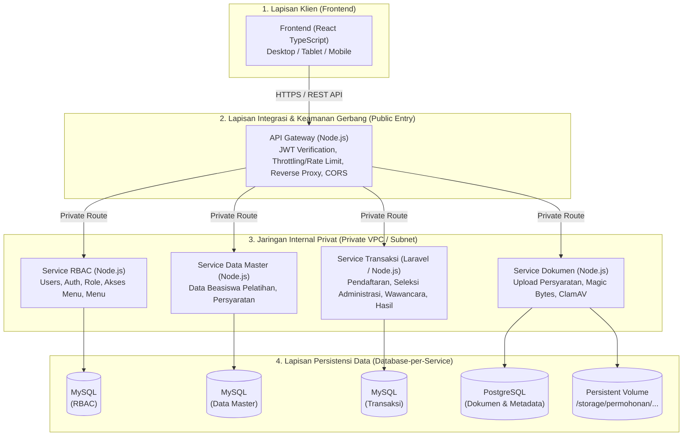
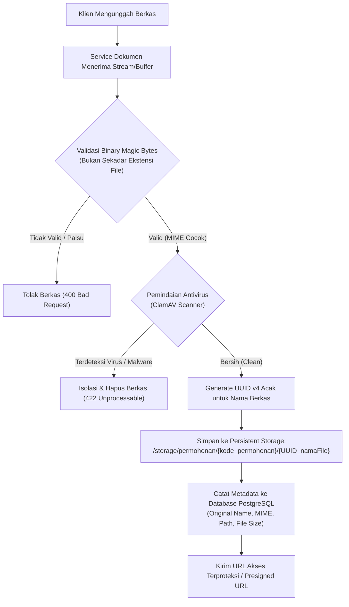
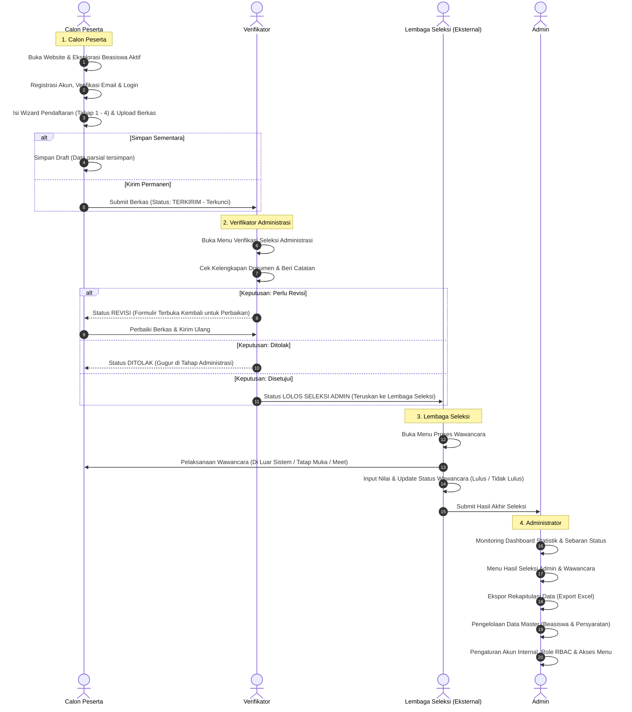
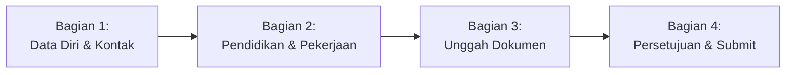
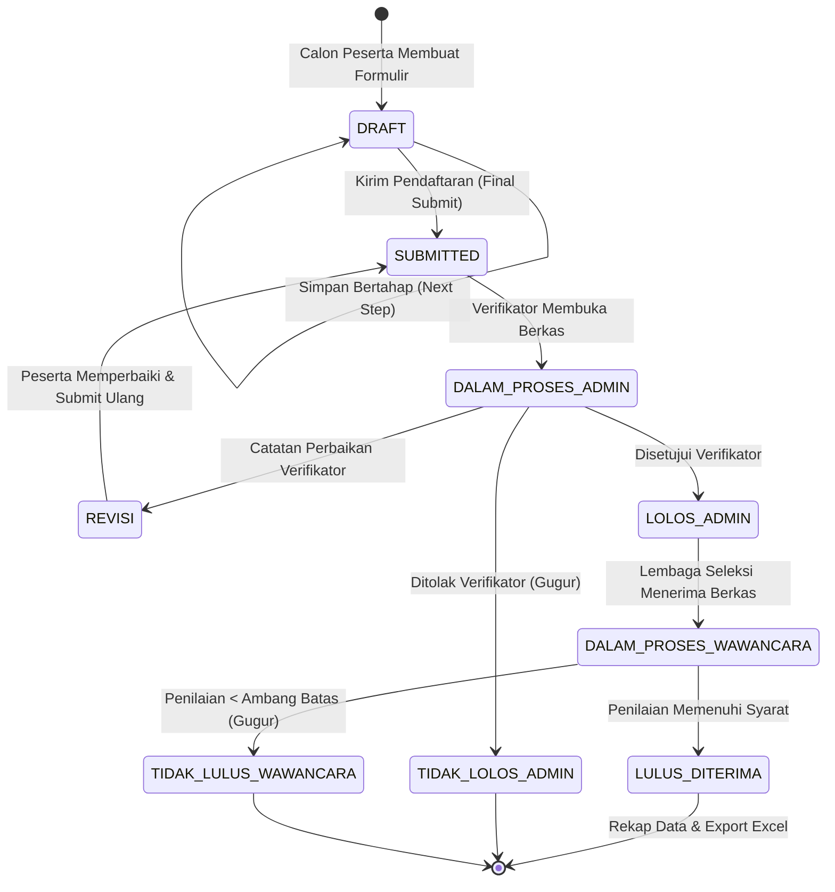

# Ketentuan Arsitektur & Alur Bisnis Sistem Pendaftaran Beasiswa Pelatihan

Dokumen ini merupakan hasil sintesis, rekonsiliasi, dan integrasi menyeluruh dari tiga sumber acuan teknis:

1. **Ketentuan Arsitektur (PDF):** `E:\IDM Downloads\Documents\KETENTUAN ARSITEKTUR.pdf`
2. **Diagram Alur Proses Bisnis (Screenshot):** `C:\Users\Baiq\Pictures\Screenshots\Screenshot 2026-09-07 162929.png`
3. **Diagram Arsitektur Sistem Microservices (Screenshot):** `C:\Users\Baiq\Pictures\Screenshots\Screenshot 2026-09-07 163336.png`

---

## 1. Ringkasan Eksekutif & Paradigma Arsitektur

Sistem **Aplikasi Pendaftaran Beasiswa Pelatihan** dirancang menggunakan arsitektur **Microservices Decoupled** dengan penerapan pemisahan repositori per-layanan (_Multi-Repository Pattern_). Sistem ini mengintegrasikan lapisan antarmuka pengguna responsif (_Desktop, Tablet, Mobile_), gerbang API terpusat (_API Gateway_), empat domain mikroservis terisolasi pada jaringan privat (_Private VPC/Subnet_), serta persistensi basis data terdistribusi (_Database-per-Service_ menggunakan MySQL dan PostgreSQL).



---

## 2. Dekomposisi Layanan & Spesifikasi Teknologi

Sistem terdiri atas **6 modul/kontainer layanan mandiri**:

| Layanan / Modul | Teknologi Utama | Basis Data | Tanggung Jawab & Fitur Kunci |
| :-- | :-- | :-- | :-- |
| **Frontend** | React (TypeScript) | N/A | • Antarmuka responsif (Desktop, Tablet, Mobile)<br>• _Multi-step Form Wizard_ pendaftaran<br>• _Client-side state & draft caching_<br>• Proteksi XSS bawaan (_built-in auto escaping_) |
| **API Gateway** | Node.js | N/A | • Titik masuk tunggal (_Single Public Entry Point_)<br>• Verifikasi token JWT sebelum meneruskan ke mikroservis<br>• _Rate Limiting / Throttling_ (maks. 100 req/menit)<br>• _Strict CORS policy_ (hanya mengizinkan domain Frontend)<br>• _Reverse Proxy & Load Routing_ |
| **Service RBAC** | Node.js | MySQL | • Manajemen Akun Pengguna (_Users CRUD_)<br>• Autentikasi & Login Sesi<br>• Manajemen Peran (_Role CRUD_) & Hak Akses Menu<br>• Manajemen Navigasi/Menu Dinamis |
| **Service Data Master** | Node.js | MySQL | • _CRUD_ Data Beasiswa Pelatihan (periode, kuota, deskripsi)<br>• _CRUD_ Data Persyaratan (kriteria berkas wajib/opsional) |
| **Service Transaksi** | Laravel atau Node.js | MySQL | • Pengelolaan alur Pendaftaran (_Application Workflow_)<br>• Tahap Seleksi Administrasi (antrean & hasil periksa)<br>• Tahap Seleksi Wawancara (antrean lolos & skor penilaian)<br>• Publikasi Hasil Seleksi & Ekspor Rekap Data (_Excel_) |
| **Service Dokumen** | Node.js | PostgreSQL | • Unggah & unduh dokumen persyaratan pendaftaran<br>• Verifikasi _Binary Magic Bytes_<br>• Pemindaian berkas dengan _ClamAV Antivirus_<br>• Obfuscation nama berkas dengan UUID acak<br>• Pembuatan _Presigned URL_ / _Stream Endpoint_ berizin |

### Ketentuan ORM & Kueri Database

- **Layanan Node.js:** Wajib menggunakan **Prisma** atau **Knex** (atau _parameterized prepared statements_).
- **Layanan Laravel:** Wajib menggunakan **Eloquent ORM** (atau _parameterized prepared statements_).
- **Larangan Keras:** Penggabungan string langsung (_raw string concatenation_) pada kueri SQL dilarang tanpa toleransi untuk mencegah celah _SQL Injection_.

---

## 3. Ketentuan Infrastruktur, Repositori & Deployment

1. **Pola Multi-Repository (Mandatory Multi-Repo):**
   - Setiap layanan merupakan satu repositori Git tersendiri:
     1. `repo-frontend`
     2. `repo-api-gateway`
     3. `repo-service-rbac`
     4. `repo-service-master`
     5. `repo-service-transaksi`
     6. `repo-service-dokumen`
   - _Monorepo_ dilarang untuk _delivery_ keseluruhan pada produksi sesuai ketentuan arsitektur resmi.
2. **Kontainerisasi & Isolasi Jaringan:**
   - Seluruh layanan dikemas dalam kontainer Docker terpisah (_Docker Compose_ atau _Kubernetes_).
   - Mikroservis internal (`RBAC`, `Data Master`, `Transaksi`, `Dokumen`) berada di dalam _Private Subnet/VPC_. Port internal tidak boleh dibuka langsung ke jaringan publik; hanya API Gateway yang menerima _traffic_ luar.
3. **Penyimpanan Permanen (_Persistent Storage Volumes_):**
   - Setiap kontainer yang menyimpan _state_ (Database MySQL, PostgreSQL, dan direktori berkas fisik) wajib di-_mount_ ke _Persistent Volume_ (Docker Volume / K8s PersistentVolumeClaim) agar data tidak hilang ketika kontainer di-_restart_ atau di-_redeploy_.

---

## 4. Keamanan Sistem & Standar Pertahanan Siber

### 4.1 Autentikasi & Otorisasi

- **Pola Token Ganda (_Dual-Token Authentication_):**
  - **Access Token:** Menggunakan JSON Web Token (JWT) dengan masa berlaku pendek (**~15 menit**), dikirimkan via _Authorization Header_ (`Bearer <token>`).
  - **Refresh Token:** Disimpan secara aman pada _cookie_ bertipe **`HttpOnly`**, `Secure`, dan berkonfigurasi `SameSite=Strict`.
- **Verifikasi di Tingkat Gerbang:** API Gateway memvalidasi keabsahan JWT secara langsung sebelum melewatkan permintaan ke mikroservis internal.
- **Pencegahan IDOR (_Insecure Direct Object Reference_):**
  - Setiap _endpoint_ transaksi dan dokumen wajib memvalidasi kepemilikan data: pengguna hanya dapat mengakses data permohonan miliknya sendiri, kecuali pengguna memiliki peran yang terotorisasi (_Verifikator/Admin_).

### 4.2 Sanitasi Input & Pencegahan Celah Web

- **Anti-SQL Injection:** Menggunakan _Prepared Statements_ / ORM bawaan.
- **Anti-XSS (Cross-Site Scripting):**
  - Pembersihan string input di sisi _backend_ menggunakan pustaka sanitasi (e.g. _DOMPurify_ atau sejenis).
  - Pemanfaatan _auto-escaping_ alami React di sisi _frontend_ (menghindari penggunaan `dangerouslySetInnerHTML`).
- **Mitigasi Serangan DoS / Brute-Force:** API Gateway menerapkan _Rate Limiting_ dengan batas maksimal **100 permintaan/menit per IP/klien**.

---

## 5. Manajemen & Keamanan Dokumen Unggahan

Pengelolaan dokumen persyaratan pada `Service Dokumen` tunduk pada parameter keamanan ketat:



### Aturan Kunci Penyimpanan Dokumen:

1. **Deteksi Berkas Berbasis Magic Bytes:**
   - Ekstensi file (`.pdf`, `.jpg`, `.png`) tidak dijadikan acuan keabsahan karena mudah dimanipulasi.
   - Sistem wajib membaca byte pembuka (_header magic bytes_), misalnya `%PDF-` (`0x25 0x50 0x44 0x46`) untuk dokumen PDF, dan `FF D8 FF` untuk format JPEG.
2. **Pemindaian Malware (ClamAV):**
   - Sebelum berkas ditulis ke _storage_ permanen, berkas wajib dipindai melalui _ClamAV daemon_. Berkas bervirus langsung ditolak dan dimusnahkan.
3. **Isolasi Berkas Non-Publik & Naming Obfuscation:**
   - Berkas dilarang disimpan dalam direktori _web root_ publik (_no direct static URL_).
   - Nama asli dari pengguna harus diganti dengan UUID acak.
   - Pola struktur direktori:
     ```
     /storage/permohonan/{kode_permohonan}/{UUID_namaFile}
     Contoh: /storage/permohonan/PRM-2026-001/ktp_9b1deb4d-3b7d-4f52-b88a-c8e6df10992a.pdf
     ```
4. **Mekanisme Akses Unduh:**
   - Tidak ada tautan langsung statis yang dapat ditebak.
   - Akses pembacaan berkas hanya dilayani lewat _endpoint streaming_ berotentikasi atau _Presigned URL_ dengan masa kedaluwarsa singkat dan izin terbatas.

---

## 6. Alur Bisnis & Pemetaan Peran (Swimlane Business Process)

Berdasarkan _Flowchart_ Proses Bisnis, sistem melibatkan **4 Aktor / Peran**:



---

## 7. Mekanisme Formulir Pendaftaran Bertahap (Multi-Step Wizard)

Untuk memastikan pengalaman pengguna yang optimal pada formulir yang kompleks, formulir pendaftaran wajib dipecah menjadi **4 bagian bertahap (_Stepper/Wizard_)**:



### Rincian Bidang & Data per Langkah:

1. **Bagian 1: Data Diri & Kontak**
   - Nomor Induk Kependudukan (`NIK` - 16 digit angka)
   - Nama Lengkap (sesuai KTP)
   - Tanggal Lahir
   - Alamat Domisili Lengkap
   - Nomor HP Utama
   - Nomor WhatsApp / HP Alternatif
   - Alamat Email Aktif
2. **Bagian 2: Latar Belakang Pendidikan & Pekerjaan**
   - Jenjang Pendidikan Terakhir (SMA/SMK, D3, S1, dsb.)
   - Nama Instansi / Sekolah / Universitas Asal
   - Jurusan / Program Studi
   - Status Pekerjaan Saat Ini
3. **Bagian 3: Unggah Dokumen Pendukung**
   - Berkas KTP (Format PDF/JPG, validasi magic bytes)
   - Berkas Kartu Keluarga (KK)
   - Berkas Ijazah Terakhir / Transkrip
   - Berkas Surat Rekomendasi
4. **Bagian 4: Lembar Persetujuan (Final Review & Checklist)**
   - Ringkasan seluruh data yang telah diisikan (_Summary View_)
   - Pernyataan kebenaran data & fakta (_Checklist Pernyataan_)
   - Pilihan Aksi: **Simpan Sebagai Draft** atau **Kirim Pendaftaran (Final Submit)**

### Aturan Teknis Penyimpanan Wizard:

- **Penyimpanan Instan per Tahap (_Immediate Step Persistence_):** Ketika pelamar menekan tombol **"Selanjutnya"** atau **"Selesai"**, data pada bagian tersebut **langsung disimpan ke basis data**.
- **Fitur Lanjut Nanti (_Resume Later_):** Pelamar dapat keluar dari sistem kapan saja tanpa kehilangan progres pengisian. Formulir akan otomatis melanjutkan pada tahap terakhir yang belum selesai.
- **Kunci Status (_State Locking_):**
  - Saat pendaftaran berstatus `DRAFT`: Semua bagian formulir bebas diubah.
  - Saat pendaftaran berstatus `SUBMITTED / TERKIRIM`: Formulir **terkunci penuh (_Read-Only_)** dan tidak dapat disunting oleh pelamar.
  - Saat pendaftaran berstatus `REVISI`: Bagian atau dokumen tertentu yang diberi catatan oleh verifikator **dibuka kembali kuncinya** untuk diperbaiki oleh pelamar.

---

## 8. State Machine & Siklus Hidup Permohonan

Status pendaftaran bergerak melalui mesin status (_Finite State Machine_) yang ketat:



### Penjelasan Nilai Status:

- `DRAFT`: Formulir sedang diisi, data tersimpan sebagian.
- `SUBMITTED`: Berkas terkirim lengkap, data terkunci, masuk antrean verifikasi.
- `DALAM_PROSES_ADMIN`: Berkas sedang ditinjau oleh Verifikator.
- `REVISI`: Verifikator meminta perbaikan berkas/data tertentu dengan catatan resmi.
- `TIDAK_LOLOS_ADMIN`: Berkas tidak memenuhi syarat seleksi administratif (tahap berakhir).
- `LOLOS_ADMIN`: Lolos administrasi, diteruskan ke antrean jadwal wawancara.
- `DALAM_PROSES_WAWANCARA`: Peserta dalam agenda penilaian wawancara oleh Lembaga Seleksi.
- `TIDAK_LULUS_WAWANCARA`: Penilaian akhir wawancara tidak memenuhi kriteria kelulusan.
- `LULUS_DITERIMA`: Peserta dinyatakan diterima dan siap diumumkan/diekspor rekapnya oleh Admin.

---

## 9. Struktur Data Entitas Utama

Berikut ringkasan relasi dan rancangan entitas lintas basis data:

### A. Basis Data RBAC (`MySQL: rbac_db`)

- **`users`**: `id`, `name`, `email`, `password_hash`, `role_id`, `is_active`, `created_at`, `updated_at`
- **`roles`**: `id`, `name` (_superadmin, admin, verifikator, interviewer, applicant_), `description`
- **`menus`**: `id`, `name`, `route`, `icon`, `parent_id`, `order_index`, `is_active`
- **`role_menu_permissions`**: `role_id`, `menu_id`, `can_view`, `can_create`, `can_update`, `can_delete`

### B. Basis Data Master (`MySQL: master_db`)

- **`beasiswa_pelatihan`**: `id`, `kode_beasiswa`, `nama_pelatihan`, `deskripsi`, `kuota`, `tgl_mulai_daftar`, `tgl_selesai_daftar`, `is_active`
- **`persyaratan`**: `id`, `beasiswa_id`, `nama_persyaratan`, `tipe_dokumen`, `is_mandatory`, `max_file_size_kb`

### C. Basis Data Transaksi (`MySQL: transaksi_db`)

- **`pendaftaran`**:
  - `id`, `kode_permohonan` (misal: `PRM-2026-001`), `user_id`, `beasiswa_id`, `status` (_Enum State Machine_), `step_wizard_terakhir`, `submitted_at`
- **`biodata_pendaftar`**:
  - `id`, `pendaftaran_id`, `nik`, `nama_lengkap`, `tgl_lahir`, `alamat`, `no_hp`, `no_wa`, `email`
- **`riwayat_pendidikan_pekerjaan`**:
  - `id`, `pendaftaran_id`, `pendidikan_terakhir`, `nama_instansi`, `jurusan`, `pekerjaan_saat_ini`
- **`verifikasi_administrasi`**:
  - `id`, `pendaftaran_id`, `verifikator_id`, `checklist_ktp`, `checklist_kk`, `checklist_ijazah`, `checklist_rekomendasi`, `catatan_revisi`, `status_keputusan`, `verified_at`
- **`penilaian_wawancara`**:
  - `id`, `pendaftaran_id`, `interviewer_id`, `nilai_wawancara`, `catatan_evaluasi`, `status_hasil`, `evaluated_at`

### D. Basis Data Dokumen (`PostgreSQL: dokumen_db`)

- **`dokumen_permohonan`**:
  - `id` (UUID), `pendaftaran_id`, `persyaratan_id`, `file_name_original`, `file_name_uuid`, `file_path`, `mime_type`, `file_size_bytes`, `magic_bytes_verified` (boolean), `clamav_scan_status` (_CLEAN / INFECTED_), `uploaded_at`

---

## 10. Matriks Aturan: DOs and DON'Ts

| Parameter / Area | Praktik Wajib (DOs) | Larangan Keras (DON'Ts) |
| :-- | :-- | :-- |
| **Arsitektur Repositori** | Pisahkan setiap layanan ke repositori Git tersendiri (_Multi-Repo_). | **DILARANG** menggabungkan seluruh layanan ke dalam satu repositori monolitik. |
| **Akses Jaringan** | Letakkan mikroservis di Private VPC/Subnet; akses hanya melalui API Gateway. | **DILARANG** membuka port database atau port internal mikroservis langsung ke publik. |
| **Autentikasi Token** | JWT berumur pendek (~15 menit) di header + Refresh Token di `HttpOnly` cookie. | **DILARANG** menggunakan token dengan masa aktif abadi atau menyimpannya di `localStorage` tanpa proteksi. |
| **Akses Basis Data** | Gunakan ORM resmi (Prisma/Knex/Eloquent) atau _prepared statements_. | **DILARANG** menyusun kueri menggunakan konkatenasi string SQL mentah. |
| **Validasi Berkas** | Cek _Binary Magic Bytes_ dan jalankan _ClamAV Antivirus Scanner_. | **DILARANG** hanya mengandalkan ekstensi nama berkas (`.pdf`, `.jpg`). |
| **Penyimpanan Berkas** | Gunakan _Persistent Volume_, rename dengan UUID acak, struktur `/storage/permohonan/...`. | **DILARANG** menyimpan berkas di folder publik web server atau membiarkan nama asli pengguna. |
| **Pengambilan Berkas** | Akses via _Streaming API_ terotentikasi atau _Presigned URL_ bertenggat waktu. | **DILARANG** memberikan URL statis langsung yang dapat diakses publik tanpa login. |
| **UX Formulir** | Simpan ke basis data setiap kali pelamar menekan tombol "Selanjutnya" (_Auto-Save_). | **DILARANG** menahan semua data di memori klien dan baru mengirim semuanya di akhir pengisian. |
| **Penguncian Formulir** | Kunci formulir menjadi _Read-Only_ saat status `SUBMITTED`, buka kembali hanya saat `REVISI`. | **DILARANG** mengizinkan pelamar mengubah data berkas saat proses verifikasi sedang berlangsung. |
| **Proteksi Gateway** | Terapkan _CORS Whitelist_ dan _Rate Limiting_ (100 req/menit). | **DILARANG** menyetel `CORS: *` secara terbuka atau membiarkan endpoint tanpa pembatasan frekuensi. |

---

## 11. Catatan Penyelarasan Codebase Lokal (`beasiswaapp`)

Workspace saat ini dibangun di atas pondasi awal _Better-T-Stack_ (`apps/web`, `apps/server`, `packages/ui`, `packages/db`, `packages/auth`). Untuk merealisasikan arsitektur target:

1. **Struktur Modul & Repositori:**
   - Untuk lingkungan pengembangan lokal saat ini, domain modular dapat dipetakan secara bersih sesuai batasan modul (_Clean Architecture / Modular Structure_).
   - Pada fase produksi, sesuai panduan dokumen, modul `api-gateway`, `rbac`, `master`, `transaksi`, dan `dokumen` harus dipisahkan ke dalam Git repositori dan kontainer Docker mandiri.
2. **Kesesuaian Basis Data:**
   - Modul `RBAC`, `Data Master`, dan `Transaksi` menggunakan **MySQL** (sudah didukung oleh konfigurasi Prisma saat ini).
   - Modul `Dokumen` memerlukan penambahan instance/koneksi **PostgreSQL** khusus untuk metadata dokumen serta integrasi kontainer _ClamAV_ untuk pemindaian berkas.
3. **Pengembangan Antarmuka (React TS):**
   - Komponen antarmuka yang ada di `apps/web` dapat langsung memanfaatkan styling dan komponen UI untuk menyusun antarmuka formulir bertahap (_Stepper Form Wizard_), tabel antrean seleksi verifikator, penilaian wawancara, dan dasbor analitik admin.
