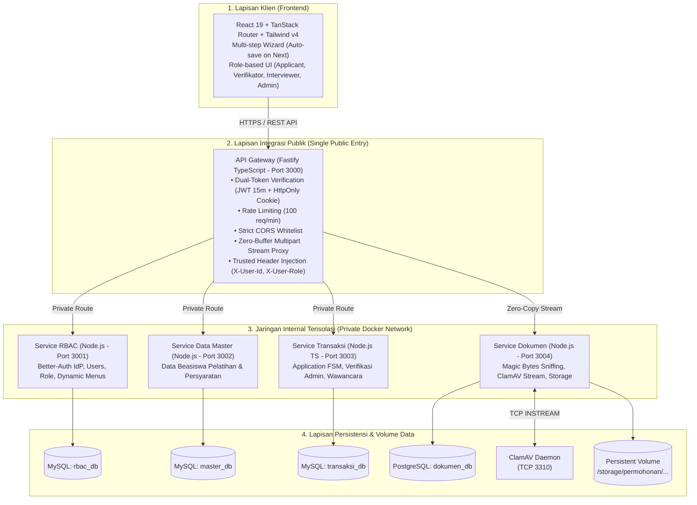

# Keputusan Arsitektur, Rekomendasi Teknis & Evaluasi API Gateway

**Sistem:** Aplikasi Pendaftaran Beasiswa Pelatihan (`beasiswaapp`)  
**Dokumen Referensi Induk:** [`docs/arsitektur-dan-alur-sistem.md`](file:///D:/coding/BIT/beasiswaapp/docs/arsitektur-dan-alur-sistem.md)  
**Filosofi Pengembangan:** _Simple Systems, Ambitious Ideas; Fight Complexity; YAGNI; Type Safety First_  
**Status:** Ditetapkan & Siap Diimplementasikan (_Approved Architecture Decision Blueprint_)

---

## 1. Ringkasan Eksekutif & Tujuan Dokumen

Dokumen ini merupakan hasil sintesis, investigasi mendalam, dan rekonsiliasi teknis dari riset 4 agen spesialis independen (_API Gateway & Cloud Architect_, _Backend & Microservices Architect_, _Cybersecurity & Storage Specialist_, dan _Frontend & UI/UX Architect_) terhadap basis kode saat ini (`beasiswaapp`) serta dokumen panduan resmi pada [`docs/arsitektur-dan-alur-sistem.md`](file:///D:/coding/BIT/beasiswaapp/docs/arsitektur-dan-alur-sistem.md).

Tujuan utama dokumen ini adalah:

1. **Menjawab secara tuntas pertanyaan terkait Kong Gateway**: Apakah Kong Gateway tepat untuk sistem ini, apa kelemahan serta kelebihannya, dan teknologi apa yang paling tepat untuk kebutuhan kita.
2. **Menjembatani transisi arsitektur**: Mengubah fondasi awal monorepo (_Better-T-Stack: Express + Better-Auth + Prisma MySQL_) menjadi arsitektur multi-servis modular yang taat pada standar isolasi jaringan privat, persistensi _Database-per-Service_, pemindaian _ClamAV_, serta alur formulir bertahap (_Multi-step Wizard_).
3. **Menetapkan _Architecture Decision Records_ (ADR)** yang konkret dan siap dieksekusi oleh tim pengembang tanpa ambiguitas teknis.



---

## 2. Riset Mendalam: Kong Gateway vs Alternatif

### 2.1 Menjawab Pertanyaan Pengguna

> _"Dan saya juga mendengar bahwa Kong Gateway adalah cara terbaik untuk menangani multiple services? (lakukan riset mendalam, lalu pilih yang terbaik untuk kasus kita)"_

**Kesimpulan Evaluasi:**  
**Kong Gateway (khususnya edisi Open-Source / Community Edition) TIDAK DIREKOMENDASIKAN untuk sistem ini karena memperkenalkan kompleksitas yang berlebihan (_over-engineering_), ketidaksesuaian tumpukan teknologi, serta hambatan integrasi kritis pada fitur JWT dan pengunggahan berkas.**

Pilihan paling tepat, efisien, dan selaras dengan prinsip _"Fight Complexity"_ serta dokumen spesifikasi resmi ([`docs/arsitektur-dan-alur-sistem.md` Bagian 2](file:///D:/coding/BIT/beasiswaapp/docs/arsitektur-dan-alur-sistem.md#L62)) adalah **Lightweight Node.js API Gateway berbasis Fastify**.

---

### 2.2 Tiga Titik Kegagalan Kritis Kong Gateway OSS untuk Kasus Kita

#### 1. Masalah Ekstraksi Klaim JWT & "Paywall" Fitur Enterprise

- Pada **Kong Community Edition (OSS)**, plugin bawaan `jwt` dirancang untuk mengautentikasi kredensial konsumen API statis (_Consumer-based_), **bukan identitas pengguna akhir aplikasi web dinamis**.
- Setelah memverifikasi tanda tangan JWT, Kong OSS **tidak dapat mengekstrak klaim dinamis** seperti `sub`, `userId`, atau `role` untuk diteruskan ke downstream service via header `X-User-Id` dan `X-User-Role`. Fitur ini (_JWT Claims to Upstream Headers_ dan _OpenID Connect_) dikunci secara eksklusif pada **Kong Enterprise (Lisensi Berbayar)**.
- Untuk memaksakan Kong OSS melakukan hal ini, tim pengembang harus menulis dan memelihara **skrip Lua manual** di dalam plugin `post-function`. Menulis kode bisnis di dalam string konfigurasi YAML tanpa linting, compiler, maupun unit-test otomatis sangat rentan rusak (_brittle_) saat pembaruan versi Kong.
- Selain itu, Kong OSS tidak mendukung ekstraksi token sesi otomatis dari _HttpOnly Cookie_ yang diterbitkan oleh Better-Auth tanpa injeksi skrip Lua tambahan.

#### 2. Hambatan _Buffering_ Pengunggahan Berkas (Service Dokumen)

- Inti Kong dibangun di atas OpenResty (Nginx). Secara _default_, Nginx menahan (_buffer_) badan permintaan HTTP ke dalam memori RAM (`client_body_buffer_size`) dan menuliskannya ke berkas sementara di disk (`client_body_temp_path`) jika ukuran berkas melebihi ambang batas.
- Pada aplikasi beasiswa di mana ribuan pelamar mengunggah berkas PDF, KTP, dan Ijazah berukuran besar yang harus segera dipindai oleh _ClamAV_, perilaku _buffering_ Kong ini membebani I/O disk, meningkatkan latensi, dan membutuhkan penyetelan Nginx tingkat rendah yang kompleks (`proxy_request_buffering off`, `client_max_body_size 50m`).

#### 3. Ketidaksesuaian Ekosistem & Pemborosan Sumber Daya

- Seluruh basis kode proyek kita menggunakan **100% TypeScript / Node.js** (`apps/web`, `apps/server`, `packages/auth`, `packages/db`, `packages/env`). Memasukkan Kong mengharuskan tim mengelola _runtime_ Nginx/LuaJIT yang asing.
- **Konsumsi Memori:** Kong OSS membutuhkan RAM _idle_ sebesar **~350 MB – 500 MB** (dan bertambah jika menggunakan mode DB dengan PostgreSQL tersendiri). Sebagai perbandingan, Fastify Gateway hanya membutuhkan **~45 MB – 65 MB** RAM.
- **Pelanggaran Mandat Dokumen:** Dokumen [`docs/arsitektur-dan-alur-sistem.md` Bagian 2](file:///D:/coding/BIT/beasiswaapp/docs/arsitektur-dan-alur-sistem.md#L62) secara eksplisit menetapkan: **`API Gateway: Node.js`**.

---

### 2.3 Matriks Perbandingan Multi-Dimensi API Gateway

| Kriteria Evaluasi | Kong Gateway OSS (DB-less) | Fastify Gateway (Node.js) | Traefik v3 (OSS) | KrakenD (CE) | Apache APISIX |
| :-- | :-- | :-- | :-- | :-- | :-- |
| **Konsumsi RAM (Idle)** | 🔴 Tinggi (~400 MB) | 🟢 Sangat Ringan (~55 MB) | 🟢 Ringan (~30 MB) | 🟢 Ultra Ringan (~20 MB) | 🟡 Sedang (~160 MB + etcd) |
| **Validasi JWT & Klaim Dinamis** | 🔴 Butuh Skrip Lua (Berbayar di Ent) | 🟢 Native TypeScript (`jose`) | 🟡 Butuh Auth Subrequest | 🟢 Didukung via DSL | 🟢 Plugin bawaan |
| **Forwarding `X-User-Id` / Role** | 🔴 Manual via Lua hack | 🟢 Otomatis & Type-Safe | 🟡 Butuh Auth Subrequest | 🟢 Didukung via DSL | 🟢 Plugin bawaan |
| **Integrasi Cookie Better-Auth** | 🔴 Rumit (Lua parsing) | 🟢 Native (`@fastify/cookie`) | 🟡 Via Auth Subrequest | 🔴 Rumit / Hanya Header | 🟡 Skrip Plugin |
| **Streaming File Multipart (Upload)** | 🟡 Butuh tuning Nginx buffer | 🟢 True Socket Streaming | 🟢 Streaming Native | 🟡 Konfigurasi ketat | 🟢 Streaming Native |
| **Rate Limiting (100 req/min)** | 🟢 Plugin bawaan | 🟢 Plugin `@fastify/rate-limit` | 🟢 Middleware bawaan | 🟢 Komponen bawaan | 🟢 Plugin bawaan |
| **CORS Policy Strict Whitelist** | 🟢 Plugin bawaan | 🟢 Plugin `@fastify/cors` | 🟢 Middleware bawaan | 🟢 Komponen bawaan | 🟢 Plugin bawaan |
| **Kesesuaian Tumpukan Tim** | 🔴 Lua / OpenResty / Nginx | 🟢 100% TypeScript / Node.js | 🟡 Go / YAML Labels | 🟡 Go / JSON DSL | 🔴 Lua / etcd |
| **Kepatuhan Terhadap Dokumen** | 🟡 Menyimpang dari spek Node.js | 🟢 Sesuai Dokumen Resmi | 🟡 Menyimpang dari spek | 🟡 Menyimpang dari spek | 🟡 Menyimpang dari spek |
| **Filosofi "Fight Complexity"** | 🔴 Berat & Banyak Seremoni | 🟢 Paling Sederhana & Tepat Guna | 🟡 Menengah | 🟡 Menengah | 🔴 Berat (wajib cluster etcd) |

---

### 2.4 Solusi Terpilih: Fastify-based TypeScript API Gateway

Fastify dipilih karena memiliki performa _throughput_ tertinggi di ekosistem Node.js (3x–5x lebih cepat dari Express), menyediakan mekanisme _streaming_ soket langsung tanpa penulisan berkas sementara ke disk (`@fastify/http-proxy`), dan memberikan _type-safety_ penuh dalam memverifikasi token dan meneruskan header identitas ke internal mikroservis.

#### Cetak Biru Implementasi Gateway (`apps/api-gateway/src/index.ts`)

```typescript
import Fastify from "fastify";
import cors from "@fastify/cors";
import rateLimit from "@fastify/rate-limit";
import httpProxy from "@fastify/http-proxy";
import cookie from "@fastify/cookie";
import { jwtVerify } from "jose";

const app = Fastify({
  logger: { level: process.env.LOG_LEVEL || "info" },
  trustProxy: true,
});

const CORS_ORIGIN = process.env.CORS_ORIGIN || "http://localhost:3001";
const JWT_SECRET = new TextEncoder().encode(
  process.env.BETTER_AUTH_SECRET || "default-secret-key-min-32-chars"
);
const INTERNAL_SECRET =
  process.env.INTERNAL_CLUSTER_SECRET || "cluster-shared-secret-key";

const UPSTREAMS = {
  rbac: process.env.UPSTREAM_RBAC_URL || "http://service-rbac:3001",
  master: process.env.UPSTREAM_MASTER_URL || "http://service-master:3002",
  transaksi:
    process.env.UPSTREAM_TRANSAKSI_URL || "http://service-transaksi:3003",
  dokumen: process.env.UPSTREAM_DOKUMEN_URL || "http://service-dokumen:3004",
};

// 1. Strict CORS Whitelist (Khusus Domain Frontend)
await app.register(cors, {
  origin: [CORS_ORIGIN],
  credentials: true,
  methods: ["GET", "POST", "PUT", "PATCH", "DELETE", "OPTIONS"],
  allowedHeaders: ["Content-Type", "Authorization", "X-Requested-With"],
});

// 2. Rate Limiting: Maksimal 100 req/menit per IP
await app.register(rateLimit, {
  max: 100,
  timeWindow: "1 minute",
  errorResponseBuilder: (_req, context) => ({
    statusCode: 429,
    error: "Too Many Requests",
    message: `Batas frekuensi permintaan terlampaui. Maksimal ${context.max} permintaan per menit.`,
  }),
});

await app.register(cookie);

// 3. Verifikasi Dual-Token & Injeksi Header Identitas
async function authenticateUser(req: any) {
  let token = req.headers.authorization?.startsWith("Bearer ")
    ? req.headers.authorization.substring(7)
    : undefined;

  if (!token && req.cookies) {
    token =
      req.cookies["better-auth.session_token"] ||
      req.cookies["__Secure-better-auth.session_token"];
  }

  if (!token) return null;

  try {
    const { payload } = await jwtVerify(token, JWT_SECRET);
    return {
      userId: String(payload.sub || payload.userId || ""),
      role: String(payload.role || "applicant"),
      email: String(payload.email || ""),
    };
  } catch {
    return null;
  }
}

// 4. Reverse Proxy Routes
// A. RBAC & Auth (Bypass auth untuk sign-in/register; protect admin routes)
await app.register(httpProxy, {
  upstream: UPSTREAMS.rbac,
  prefix: "/api/auth",
  rewritePrefix: "/api/auth",
});

await app.register(httpProxy, {
  upstream: UPSTREAMS.rbac,
  prefix: "/api/rbac",
  rewritePrefix: "/api/rbac",
  preHandler: async (req, reply) => {
    const user = await authenticateUser(req);
    if (!user)
      return reply
        .status(401)
        .send({ error: "Sesi tidak valid atau telah kedaluwarsa." });
    req.headers["x-user-id"] = user.userId;
    req.headers["x-user-role"] = user.role;
    req.headers["x-internal-secret"] = INTERNAL_SECRET;
  },
  replyOptions: {
    rewriteRequestHeaders: (req, headers) => ({
      ...headers,
      "x-user-id": req.headers["x-user-id"],
      "x-user-role": req.headers["x-user-role"],
      "x-internal-secret": req.headers["x-internal-secret"],
    }),
  },
});

// B. Data Master (Publik dapat membaca katalog; mutasi wajib login)
await app.register(httpProxy, {
  upstream: UPSTREAMS.master,
  prefix: "/api/master",
  rewritePrefix: "/api/master",
  preHandler: async (req, reply) => {
    if (req.method !== "GET" && req.method !== "OPTIONS") {
      const user = await authenticateUser(req);
      if (!user || (user.role !== "admin" && user.role !== "superadmin")) {
        return reply
          .status(403)
          .send({ error: "Hak akses administrator diperlukan." });
      }
      req.headers["x-user-id"] = user.userId;
      req.headers["x-user-role"] = user.role;
      req.headers["x-internal-secret"] = INTERNAL_SECRET;
    }
  },
  replyOptions: {
    rewriteRequestHeaders: (req, headers) => ({
      ...headers,
      ...(req.headers["x-user-id"]
        ? { "x-user-id": req.headers["x-user-id"] }
        : {}),
      ...(req.headers["x-user-role"]
        ? { "x-user-role": req.headers["x-user-role"] }
        : {}),
      "x-internal-secret": INTERNAL_SECRET,
    }),
  },
});

// C. Transaksi (Alur Pendaftaran Wizard, Verifikasi, Wawancara)
await app.register(httpProxy, {
  upstream: UPSTREAMS.transaksi,
  prefix: "/api/transaksi",
  rewritePrefix: "/api/transaksi",
  preHandler: async (req, reply) => {
    const user = await authenticateUser(req);
    if (!user)
      return reply
        .status(401)
        .send({ error: "Silakan masuk terlebih dahulu." });
    req.headers["x-user-id"] = user.userId;
    req.headers["x-user-role"] = user.role;
    req.headers["x-internal-secret"] = INTERNAL_SECRET;
  },
  replyOptions: {
    rewriteRequestHeaders: (req, headers) => ({
      ...headers,
      "x-user-id": req.headers["x-user-id"],
      "x-user-role": req.headers["x-user-role"],
      "x-internal-secret": req.headers["x-internal-secret"],
    }),
  },
});

// D. Dokumen (Streaming Unggah Berkas & Unduh Terproteksi - Zero Disk Buffering)
await app.register(httpProxy, {
  upstream: UPSTREAMS.dokumen,
  prefix: "/api/dokumen",
  rewritePrefix: "/api/dokumen",
  preHandler: async (req, reply) => {
    const user = await authenticateUser(req);
    if (!user)
      return reply
        .status(401)
        .send({ error: "Silakan masuk terlebih dahulu." });
    req.headers["x-user-id"] = user.userId;
    req.headers["x-user-role"] = user.role;
    req.headers["x-internal-secret"] = INTERNAL_SECRET;
  },
  replyOptions: {
    rewriteRequestHeaders: (req, headers) => ({
      ...headers,
      "x-user-id": req.headers["x-user-id"],
      "x-user-role": req.headers["x-user-role"],
      "x-internal-secret": req.headers["x-internal-secret"],
    }),
  },
});

const PORT = Number(process.env.PORT) || 3000;
await app.listen({ port: PORT, host: "0.0.0.0" });
console.log(`🚀 API Gateway berjalan pada http://0.0.0.0:${PORT}`);
```

---

### 2.5 Referensi Cadangan: Konfigurasi Declarative Kong Gateway (`kong.yml`)

Apabila terdapat kewajiban kepatuhan dari regulator atau pihak eksternal yang mengharuskan penggunaan Kong Gateway, berikut berkas deklaratif Kong DB-less yang telah disesuaikan agar mampu memintas batasan Kong OSS melalui injeksi skrip Lua:

```yaml
# kong.yml - Declarative DB-less Configuration
_format_version: "3.0"
_transform: true

services:
  - name: service-rbac
    url: http://service-rbac:3001/api/auth
    routes:
      - name: rbac-auth-route
        paths: [/api/auth]
        strip_path: false
    plugins:
      - name: rate-limiting
        config: { minute: 100, policy: local }
      - name: cors
        config:
          origins: [http://localhost:3001]
          credentials: true
          headers: [Content-Type, Authorization]
          methods: [GET, POST, OPTIONS]

  - name: service-master
    url: http://service-master:3002/api/master
    routes:
      - name: master-route
        paths: [/api/master]
        strip_path: false
    plugins:
      - name: rate-limiting
        config: { minute: 100, policy: local }
      - name: post-function
        config:
          access:
            - |
              local jwt_parser = require("kong.plugins.jwt.jwt_parser")
              local auth = kong.request.get_header("authorization")
              if auth then
                local _, _, token = string.find(auth, "%s+(%S+)")
                if token then
                  local claims = jwt_parser:new(token)
                  if claims and claims.claims then
                    kong.service.request.set_header("X-User-Id", claims.claims.sub or "")
                    kong.service.request.set_header("X-User-Role", claims.claims.role or "")
                  end
                end
              end

  - name: service-transaksi
    url: http://service-transaksi:3003/api/transaksi
    routes:
      - name: transaksi-route
        paths: [/api/transaksi]
        strip_path: false
    plugins:
      - name: rate-limiting
        config: { minute: 100, policy: local }
      - name: post-function
        config:
          access:
            - |
              local jwt_parser = require("kong.plugins.jwt.jwt_parser")
              local auth = kong.request.get_header("authorization")
              if auth then
                local _, _, token = string.find(auth, "%s+(%S+)")
                if token then
                  local claims = jwt_parser:new(token)
                  if claims and claims.claims then
                    kong.service.request.set_header("X-User-Id", claims.claims.sub or "")
                    kong.service.request.set_header("X-User-Role", claims.claims.role or "")
                  end
                end
              end

  - name: service-dokumen
    url: http://service-dokumen:3004/api/dokumen
    routes:
      - name: dokumen-route
        paths: [/api/dokumen]
        strip_path: false
    plugins:
      - name: rate-limiting
        config: { minute: 100, policy: local }
      - name: post-function
        config:
          access:
            - |
              local jwt_parser = require("kong.plugins.jwt.jwt_parser")
              local auth = kong.request.get_header("authorization")
              if auth then
                local _, _, token = string.find(auth, "%s+(%S+)")
                if token then
                  local claims = jwt_parser:new(token)
                  if claims and claims.claims then
                    kong.service.request.set_header("X-User-Id", claims.claims.sub or "")
                    kong.service.request.set_header("X-User-Role", claims.claims.role or "")
                  end
                end
              end
```

---

## 3. Rekonsiliasi Monorepo vs Multi-Repo & Struktur Proyek Target

### 3.1 Dilema Paradigma Repositori

Dokumen arsitektur mewajibkan pemisahan repositori per-layanan (_Multi-Repository Pattern_) pada fase _delivery_ produksi (`repo-frontend`, `repo-api-gateway`, `repo-service-rbac`, `repo-service-master`, `repo-service-transaksi`, `repo-service-dokumen`).  
Namun, memecah repositori sejak hari pertama pengembangan lokal terbukti menurunkan kecepatan tim secara drastis (_dependency hell_, koordinasi 6 git repository terpisah, dan kesulitan pengujian integrasi).

### 3.2 Strategi Rekonsiliasi: _Isolated Modular Monorepo_ ke _Multi-Repo Split_

1. **Fase Pengembangan Lokal (Saat Ini):**
   - Tetap menggunakan struktur monorepo `pnpm` workspaces dengan batasan ketat antar-layanan (_Zero Cross-Service Import Guardrail_).
   - Setiap layanan di bawah folder `apps/` memiliki skema Prisma sendiri, migrasi mandiri, dan berkas `Dockerfile` independen.
   - Layanan tidak boleh saling mengimpor kode internal. Komunikasi antar-layanan hanya diizinkan via HTTP REST.
2. **Fase _Delivery_ Produksi:**
   - Karena setiap layanan tidak memiliki ketergantungan silang langsung, ekstraksi ke repositori Git terpisah dapat dilakukan secara deterministik menggunakan utilitas Git standar:
     ```bash
     git subtree split -P apps/service-rbac -b release-service-rbac
     git subtree split -P apps/service-master -b release-service-master
     git subtree split -P apps/service-transaksi -b release-service-transaksi
     git subtree split -P apps/service-dokumen -b release-service-dokumen
     git subtree split -P apps/api-gateway -b release-api-gateway
     git subtree split -P apps/web -b release-web
     ```
   - Paket kontrak bersama (`packages/contracts`) dapat di-_publish_ ke private registry (GitHub Packages/Verdaccio) atau disertakan sebagai submodul Git.

### 3.3 Cetak Biru Struktur Direktori Final

```text
beasiswaapp/
├── apps/
│   ├── api-gateway/                 # Fastify Reverse Proxy, JWT Guard, Rate Limiter (Port 3000)
│   │   ├── src/index.ts
│   │   ├── Dockerfile
│   │   └── package.json
│   ├── service-rbac/                # Users, Better-Auth IdP, Roles, Dynamic Menus (Port 3001)
│   │   ├── prisma/schema.prisma     # MySQL (rbac_db)
│   │   ├── src/index.ts
│   │   ├── Dockerfile
│   │   └── package.json
│   ├── service-master/              # Beasiswa & Persyaratan CRUD (Port 3002)
│   │   ├── prisma/schema.prisma     # MySQL (master_db)
│   │   ├── src/index.ts
│   │   ├── Dockerfile
│   │   └── package.json
│   ├── service-transaksi/           # 4-Step Wizard, FSM Pendaftaran, Verifikasi, Skoring (Port 3003)
│   │   ├── prisma/schema.prisma     # MySQL (transaksi_db)
│   │   ├── src/index.ts
│   │   ├── Dockerfile
│   │   └── package.json
│   ├── service-dokumen/             # Magic Bytes, ClamAV TCP Scanner, Storage, Stream (Port 3004)
│   │   ├── prisma/schema.prisma     # PostgreSQL (dokumen_db)
│   │   ├── src/index.ts
│   │   ├── Dockerfile
│   │   └── package.json
│   └── web/                         # React 19, TanStack Router, TanStack Form, Tailwind v4 (Port 3001)
│       ├── src/routes/
│       ├── Dockerfile
│       └── package.json
├── packages/
│   ├── contracts/                   # Zod schemas bersama (Wizard steps, Enums, DTOs)
│   ├── ui/                          # Shared UI styles and tokens
│   └── config/                      # Oxlint, Prettier, TypeScript shared configs
├── docker-compose.yml               # Orkestrasi lokal lengkap (Private Network & Persistent Volumes)
├── pnpm-workspace.yaml
└── package.json
```

---

## 4. Keputusan Tumpukan Backend: Node.js (TypeScript) vs Laravel untuk Service Transaksi

Dokumen spesifikasi menyatakan: _"Service Transaksi: Laravel atau Node.js"_.

### 4.1 Rekomendasi: Standardisasi Penuh pada Node.js (TypeScript)

Diputuskan secara bulat untuk menggunakan **Node.js (TypeScript) dengan Express 5 / Fastify dan Prisma 7** untuk `Service Transaksi`.

### 4.2 Alasan Penolakan Laravel untuk Service Transaksi:

1. **Penyelarasan Tipe Data Menyeluruh (_End-to-End Type Safety_):**  
   Alur formulir pendaftaran 4 tahap menggunakan skema validasi Zod yang rumit. Dengan Node.js/TypeScript, skema Zod pada `packages/contracts` dapat dipakai bersama (_1:1 shared schema_) antara formulir React frontend dan validasi backend. Memakai Laravel akan memaksa tim menduplikasi aturan validasi ke dalam PHP `FormRequest`, menciptakan risiko inkonsistensi data (_type drift_).
2. **Beban Mental Tim (_Zero Cognitive Switching_):**  
   Mengadopsi Laravel membuat tim harus beralih antara PHP (Composer, Artisan, Eloquent, PHPStan) dan TypeScript (pnpm, Oxlint, Prisma, Vite).
3. **Efisiensi Memori Kontainer:**  
   `node:24-slim` membutuhkan memori _idle_ sekitar ~50–70 MB RAM per kontainer, sedangkan Laravel (PHP-FPM + Nginx / FrankenPHP) membutuhkan ~180–250 MB RAM per kontainer.
4. **Keseragaman Operasional:**  
   Seluruh 5 layanan backend memiliki struktur _logging_ terstruktur (Pino), penanganan error (RFC 7807), dan _health-check_ yang identik.

---

## 5. Arsitektur Autentikasi, Otorisasi & Dynamic RBAC

### 5.1 Penempatan & Peran Better-Auth

- **Better-Auth** v1.7.1 yang saat ini berada di `packages/auth` **tidak boleh dipasang di downstream services** (Master, Transaksi, Dokumen), melainkan disematkan secara terpusat pada **`Service RBAC`** sebagai _Identity Provider (IdP)_.
- Mengaktifkan plugin `jwt` bawaan Better-Auth (`better-auth/plugins/jwt`) untuk menerbitkan token standar RFC 7519.

### 5.2 Siklus Hidup Dual-Token (~15 Menit JWT + HttpOnly Refresh Cookie)

1. **Access Token (JWT):**
   - Masa aktif: **15 menit**.
   - Disimpan pada memori klien (React context). Dikirim via header `Authorization: Bearer <token>`.
   - Berisi klaim: `{ sub: userId, role: roleName, email: email }`.
2. **Refresh Token (Sesi):**
   - Masa aktif: **7 hari**.
   - Disimpan dalam peramban via cookie **`HttpOnly`**, `Secure`, dan berkonfigurasi `SameSite=Strict`.
   - Tidak dapat diakses oleh skrip JavaScript di browser, memberikan perlindungan mutlak dari pencurian token akibat serangan XSS.
3. **Penyegaran Sesi Tanpa Henti (_Silent Refresh_):**
   - Saat Access Token kedaluwarsa (HTTP 401), klien memanggil `POST /api/auth/token` yang secara otomatis melampirkan cookie HttpOnly untuk mendapatkan Access Token baru.

### 5.3 Otorisasi Downstream & Anti-Spoofing

- **Edge Layer (Gateway):** Gateway memeriksa tanda tangan JWT, menghapus paksa (_strip_) seluruh header `X-User-*` yang dikirim dari klien publik, lalu menginjeksi header identitas terpercaya:
  - `X-User-Id`: ID pengguna terverifikasi.
  - `X-User-Role`: Peran pengguna (`applicant`, `verifikator`, `interviewer`, `admin`, `superadmin`).
  - `X-Internal-Secret`: Kunci rahasia jaringan internal untuk memastikan permintaan hanya datang dari Gateway.
- **Pencegahan IDOR (Insecure Direct Object Reference):** Setiap _endpoint_ pada `Service Transaksi` dan `Service Dokumen` memeriksa kepemilikan:
  ```typescript
  if (req.userRole === "applicant") {
    const data = await prisma.pendaftaran.findFirst({
      where: { id: req.params.id, userId: req.userId },
    });
    if (!data)
      return res
        .status(403)
        .json({ error: "Akses ditolak. Bukan permohonan milik Anda." });
  }
  ```

---

## 6. Persistensi Polyglot & Penataan Skema Database-per-Service

### 6.1 Dekomposisi Skema Prisma

Prisma ORM **tidak mendukung dua jenis database provider berbeda (`mysql` dan `postgresql`) dalam satu skema tunggal**.  
Oleh karena itu, paket sentral `packages/db` didekomposisi menjadi skema lokal privat di masing-masing layanan:

- `apps/service-rbac/prisma/schema.prisma` (`provider = "mysql"`, database: `rbac_db`)
- `apps/service-master/prisma/schema.prisma` (`provider = "mysql"`, database: `master_db`)
- `apps/service-transaksi/prisma/schema.prisma` (`provider = "mysql"`, database: `transaksi_db`)
- `apps/service-dokumen/prisma/schema.prisma` (`provider = "postgresql"`, database: `dokumen_db`)

### 6.2 Pola Relasi Lintas Basis Data Tanpa Foreign Key Fisik

Karena basis data terisolasi secara fisik dan logis, integritas referensial dikelola melalui 4 pola:

1. **Kunci Identitas Logis (_Logical Keys_):** Tabel `pendaftaran` menyimpan `user_id: String` (merujuk ke `rbac_db`) dan `beasiswa_id: String` (merujuk ke `master_db`) tanpa _foreign key_ SQL.
2. **Validasi Jalur Tulis (_Write-Path HTTP Validation_):** Saat pelamar membuat pendaftaran baru, `Service Transaksi` memanggil internal HTTP ke `Service Data Master` (`GET /internal/beasiswa/:id`) untuk memastikan beasiswa ada, kuota tersedia, dan tanggal pendaftaran masih aktif.
3. **Snapshot Data Historis (_Historical Immutability Snapshot_):** Saat berkas pendaftaran difinalisasi (`status = SUBMITTED`), `Service Transaksi` menduplikasi informasi penting seperti nama beasiswa dan persyaratan ke dalam catatan pendaftaran. Dengan demikian, jika admin mengubah nama beasiswa di masa depan, data riwayat pendaftaran pelamar masa lalu tetap akurat.
4. **Penghapusan Lembut (_Soft Deletes_):** Data master menggunakan kolom `is_active: Boolean` atau `deleted_at`. Penghapusan fisik (_hard delete_) dilarang keras untuk mencegah data transaksi yatim (_orphaned records_).

---

## 7. Service Dokumen & Standar Pertahanan Siber

### 7.1 Validasi Binary Magic Bytes Tanpa Buffering Memori

- Mengabaikan ekstensi nama berkas (`.pdf`, `.jpg`) yang mudah dipalsukan.
- Menerapkan pembacaan aliran data awal (_stream peek_) sepanjang **4.096 byte (4 KB)** pertama menggunakan pustaka `file-type`.
- Format berkas yang diizinkan secara mutlak:
  - **PDF:** Byte pembuka `%PDF-` (`0x25 0x50 0x44 0x46`)
  - **JPEG:** Marker SOI `0xFF 0xD8 0xFF`
  - **PNG:** Byte pembuka `0x89 0x50 0x4E 0x47 0x0D 0x0A 0x1A 0x0A`
- **Larangan Keras Berkas SVG (`image/svg+xml`):** SVG dilarang keras karena berbasis XML dan dapat disisipi skrip jahat JavaScript (`<script>`, event `onload`, dan eksploitasi XXE).

### 7.2 Integrasi Antivirus ClamAV Berkinerja Tinggi

- `Service Dokumen` membuka koneksi soket TCP langsung ke kontainer daemon `clamav:3310` menggunakan protokol **`zINSTREAM`**.
- Aliran berkas (_stream_) diteruskan secara simultan (_teeing stream_) ke soket ClamAV dan ke penyimpanan sementara disk, menghitung _hash_ SHA-256 secara langsung tanpa memakan memori RAM.
- **Strategi Dev vs Prod:**
  - _Mode Produksi:_ Menggunakan daemon ClamAV resmi dengan kebijakan _Fail-Closed_ (jika ClamAV tidak dapat dihubungi, unggahan ditolak demi keamanan).
  - _Mode Pengembangan Lokal:_ Menggunakan `MockAntivirusScanner` yang mendeteksi string uji standar internasional **EICAR**, berjalan instan (<1 ms) dan tidak memakan RAM 1,5 GB milik ClamAV asli.

### 7.3 Isolasi Penyimpanan & Obfuscation

- Berkas disimpan di luar _web root_ pada path bervolume permanen:
  ```text
  /storage/permohonan/{kode_permohonan}/{persyaratan_id}_{UUID_v4}.{ext}
  Contoh: /storage/permohonan/PRM-2026-001/ktp_9b1deb4d-3b7d-4f52-b88a-c8e6df10992a.pdf
  ```
- Unduhan dilayani secara eksklusif lewat _Authenticated Streaming Endpoint_ (`GET /api/dokumen/:id/view` atau `:id/download`) yang memeriksa izin pengguna sebelum menyalurkan aliran biner, dilengkapi header keamanan:
  - `X-Content-Type-Options: nosniff`
  - `Content-Security-Policy: default-src 'none'; sandbox`
  - `Cache-Control: private, no-cache, no-store, must-revalidate`

### 7.4 Skema Basis Data `dokumen_db` (PostgreSQL 16)

```sql
CREATE EXTENSION IF NOT EXISTS "pgcrypto";

CREATE TYPE scan_status_enum AS ENUM ('CLEAN', 'INFECTED', 'SCAN_FAILED', 'SKIPPED_MOCK');

CREATE TABLE dokumen_permohonan (
    id UUID PRIMARY KEY DEFAULT gen_random_uuid(),
    pendaftaran_id VARCHAR(64) NOT NULL,
    kode_permohonan VARCHAR(64) NOT NULL,
    persyaratan_id VARCHAR(64) NOT NULL,
    user_id VARCHAR(64) NOT NULL,
    file_name_original VARCHAR(255) NOT NULL,
    file_name_uuid VARCHAR(255) NOT NULL UNIQUE,
    file_path VARCHAR(512) NOT NULL UNIQUE,
    mime_type VARCHAR(100) NOT NULL,
    file_size_bytes BIGINT NOT NULL,
    magic_bytes_hex VARCHAR(32) NOT NULL,
    magic_bytes_verified BOOLEAN NOT NULL DEFAULT FALSE,
    sha256_hash CHAR(64) NOT NULL,
    clamav_scan_status scan_status_enum NOT NULL DEFAULT 'CLEAN',
    clamav_signature VARCHAR(255) DEFAULT NULL,
    is_active BOOLEAN NOT NULL DEFAULT TRUE,
    created_at TIMESTAMPTZ NOT NULL DEFAULT CURRENT_TIMESTAMP,
    updated_at TIMESTAMPTZ NOT NULL DEFAULT CURRENT_TIMESTAMP
);

CREATE TABLE dokumen_access_logs (
    id UUID PRIMARY KEY DEFAULT gen_random_uuid(),
    dokumen_id UUID NOT NULL REFERENCES dokumen_permohonan(id) ON DELETE CASCADE,
    user_id VARCHAR(64) NOT NULL,
    user_role VARCHAR(32) NOT NULL,
    action VARCHAR(32) NOT NULL, -- 'VIEW', 'DOWNLOAD'
    ip_address VARCHAR(45) NOT NULL,
    user_agent TEXT,
    accessed_at TIMESTAMPTZ NOT NULL DEFAULT CURRENT_TIMESTAMP
);

CREATE INDEX idx_dokumen_pendaftaran ON dokumen_permohonan(pendaftaran_id);
CREATE INDEX idx_dokumen_user_id ON dokumen_permohonan(user_id);
```

---

## 8. Arsitektur Antarmuka (Frontend) & UX Multi-Step Wizard

### 8.1 Pola Routing Bertingkat (_Nested Sub-Routes_) TanStack Router

Formulir pendaftaran dipecah menjadi sub-rute berjenjang:

```text
apps/web/src/routes/_auth/applicant/pendaftaran/$pendaftaranId/
├── route.tsx       <-- Layout utama & Resume Later Resolver
├── step-1.tsx      <-- Bagian 1: Data Diri & Kontak
├── step-2.tsx      <-- Bagian 2: Pendidikan & Pekerjaan
├── step-3.tsx      <-- Bagian 3: Unggah Dokumen Pendukung
└── step-4.tsx      <-- Bagian 4: Persetujuan & Final Submit
```

- **Fitur Lanjut Nanti (_Resume Later_):** Saat pelamar membuka `/pendaftaran/$pendaftaranId`, hook `beforeLoad` memeriksa status `step_wizard_terakhir` dan otomatis mengarahkan pelamar ke tahap yang belum tuntas.
- **Penyimpanan Seketika (_Immediate Step Persistence_):** Ketika tombol **"Selanjutnya"** ditekan, form memicu validasi Zod untuk langkah tersebut dan mengeksekusi mutasi `PUT /api/transaksi/pendaftaran/:id/step/:stepNumber`. Data tersimpan ke basis data sebelum berpindah rute.

### 8.2 Pola Formulir Terpadu (_Unified Form Pattern_) untuk Penguncian Status

Komponen form yang sama digunakan untuk 3 kondisi status tanpa duplikasi kode:

- `DRAFT`: Seluruh input aktif dan dapat disunting bebas.
- `SUBMITTED / DALAM_PROSES_ADMIN`: Seluruh input terkunci penuh (`disabled={true}`).
- `REVISI`: Formulir terbuka secara kondisional. Hanya bidang berkas yang ditandai verifikator dengan catatan revisi yang terbuka (`disabled={false}`), sedangkan bidang yang sudah sah tetap terkunci.

### 8.3 Antarmuka Verifikator & Pewawancara

1. **Split-Screen Review Verifikator:**  
   Desktop menggunakan panel _resizable_ dua sisi:
   - _Sisi Kiri:_ Viewer dokumen PDF/Gambar dilengkapi kontrol zoom, pan, dan rotasi 90°.
   - _Sisi Kanan:_ Daftar periksa berkas (KTP, KK, Ijazah, Rekomendasi) beserta kotak input catatan perbaikan.
2. **Rubrik Penilaian Lembaga Seleksi (Interviewer):**  
   Input nilai terstruktur (Motivasi, Pengetahuan Teknis, Soft Skills) dengan penghitungan skor terbobot otomatis dan indikator kelulusan instan.

### 8.4 Komponen Antarmuka (`packages/ui` & `apps/web`)

Komponen antarmuka dikembangkan secara modular dan konsisten menggunakan token desain Tailwind CSS pada `packages/ui/src/styles/globals.css`. Primitif antarmuka kustom disusun langsung dengan elemen semantik dan utilitas Tailwind.

---

## 9. Daftar Keputusan Arsitektur Lengkap (Architecture Decision Records)

| ID ADR | Judul Keputusan | Status | Inti Keputusan & Rationale |
| :-- | :-- | :-- | :-- |
| **ADR-001** | **Pemilihan API Gateway: Fastify vs Kong** | **DITERIMA** | Menolak Kong Gateway OSS karena keterbatasan ekstraksi klaim JWT, kendala buffering berkas multipart, dan pemborosan RAM (~400 MB). Menetapkan **Fastify TypeScript Gateway** (~55 MB RAM, streaming instan, type-safe, sesuai mandat dokumen). |
| **ADR-002** | **Strategi Repositori: Modular Monorepo ke Multi-Repo** | **DITERIMA** | Mengembangkan secara modular dalam satu _pnpm workspace_ selama tahap pembangunan (_development_), dan memisahkan ke repositori independen via `git subtree split` saat _delivery_ produksi. |
| **ADR-003** | **Tumpukan Service Transaksi: Node.js vs Laravel** | **DITERIMA** | Menstandarkan `Service Transaksi` pada **Node.js (TypeScript) + Prisma 7**. Menolak Laravel demi menjaga _shared Zod contracts_ dengan form wizard, mencegah _cognitive switching_, dan menghemat 65% memori kontainer. |
| **ADR-004** | **Pemisahan Skema Prisma (Database-per-Service)** | **DITERIMA** | Mendekomposisi `packages/db` menjadi 4 skema Prisma lokal per-layanan karena Prisma tidak mendukung kombinasi MySQL dan PostgreSQL dalam satu skema tunggal. |
| **ADR-005** | **Dual-Token Authentication & Edge Verification** | **DITERIMA** | Better-Auth bertindak sebagai IdP di `Service RBAC`. Menerbitkan JWT 15 menit + Cookie HttpOnly 7 hari. Gateway memverifikasi token dan menginjeksi header `X-User-Id` serta `X-User-Role`. |
| **ADR-006** | **Integritas Relasi Lintas-Database** | **DITERIMA** | Menggunakan _Logical Identity Keys_, validasi sinkronus HTTP pada jalur tulis, duplikasi _snapshot_ data pada saat _final submit_, dan _soft deletes_ pada seluruh data master. |
| **ADR-007** | **Validasi Magic Bytes & Larangan SVG** | **DITERIMA** | Memeriksa 4 KB pertama aliran berkas menggunakan `file-type` untuk format PDF, JPG, PNG. Melarang mutlak SVG demi mencegah serangan XSS dan XXE. |
| **ADR-008** | **Pemindaian ClamAV Antivirus Dual-Mode** | **DITERIMA** | Mengalirkan berkas ke daemon ClamAV via TCP `zINSTREAM` di produksi (_Fail-Closed_), serta menyediakan `MockAntivirusScanner` berbasis string EICAR di lingkungan pengujian/dev lokal. |
| **ADR-009** | **Penyimpanan Berkas Terisolasi & Akses Streaming** | **DITERIMA** | Menyimpan berkas di luar web root pada volume permanen dengan nama UUID acak. Mengakses berkas secara eksklusif lewat _Authenticated Streaming Endpoint_ dengan proteksi Anti-IDOR. |
| **ADR-010** | **Arsitektur Wizard TanStack Router & Form** | **DITERIMA** | Menggunakan sub-rute bertingkat (`/pendaftaran/$id/step-1` s.d. `step-4`) dengan validasi Zod modular, auto-save saat klik "Selanjutnya", dan resolver _Resume Later_. |
| **ADR-011** | **Unified Form Pattern untuk State Locking** | **DITERIMA** | Satu komponen formulir yang beradaptasi secara dinamis terhadap status `DRAFT` (editable), `SUBMITTED` (locked read-only), dan `REVISI` (unlocked selektif). |
| **ADR-012** | **Navigasi Dinamis Berbasis RBAC di Frontend** | **DITERIMA** | Mengambil struktur menu pengguna dari `GET /api/rbac/me/menus` yang disimpan dalam _Router Context_, dipadukan dengan _route guards_ `beforeLoad` di TanStack Router. |

---

## 10. Rencana Aksi Implementasi Bertahap (Action Plan)

### Tahap 1: Restrukturisasi Workspace & API Gateway

- [ ] Buat direktori aplikasi modular: `apps/api-gateway`, `apps/service-rbac`, `apps/service-master`, `apps/service-transaksi`, `apps/service-dokumen`.
- [ ] Pindahkan logika `apps/server` ke dalam `apps/service-rbac` sebagai modul Identity Provider (Better-Auth).
- [ ] Implementasikan Fastify API Gateway di `apps/api-gateway` dengan rute proxy, _rate-limiting_ (100 req/min), CORS whitelist, dan verifikasi JWT/Cookie.

### Tahap 2: Database-per-Service & Skema Prisma

- [ ] Buat skema Prisma lokal di masing-masing layanan:
  - `apps/service-rbac/prisma/schema.prisma` (Tabel `users`, `roles`, `menus`, `role_menu_permissions`).
  - `apps/service-master/prisma/schema.prisma` (Tabel `beasiswa_pelatihan`, `persyaratan`).
  - `apps/service-transaksi/prisma/schema.prisma` (Tabel `pendaftaran`, `biodata_pendaftar`, `riwayat_pendidikan_pekerjaan`, `verifikasi_administrasi`, `penilaian_wawancara`).
  - `apps/service-dokumen/prisma/schema.prisma` (Tabel `dokumen_permohonan`, `dokumen_access_logs` di PostgreSQL).
- [ ] Perbarui `docker-compose.yml` untuk menambahkan kontainer `postgres:16-alpine` dan `clamav/clamav:latest`.

### Tahap 3: Service Dokumen & Keamanan Siber

- [ ] Buat _pipeline_ pengunggahan berkas tanpa _buffering_ memori menggunakan `busboy` dan `file-type` (4 KB _peek_).
- [ ] Implementasikan koneksi TCP soket ke ClamAV daemon (`zINSTREAM`) beserta `MockAntivirusScanner` untuk dev lokal.
- [ ] Implementasikan _Authenticated Streaming Endpoint_ dengan pengecekan Anti-IDOR.

### Tahap 4: Frontend Multi-Step Wizard & Dashboard Peran

- [ ] Kembangkan komponen UI yang dibutuhkan untuk antarmuka pendaftaran dan peran.
- [ ] Susun sub-rute pendaftaran bertingkat (`step-1` sampai `step-4`) di `apps/web`.
- [ ] Integrasikan _Auto-Save on Next_ dan _Resume Later_ resolver.
- [ ] Bangun antarmuka split-screen untuk Verifikator dan rubrik penilaian untuk Pewawancara.
