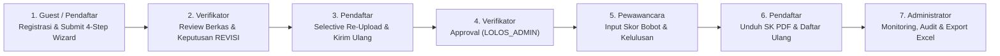

# Panduan Pengujian & Skenario Video Demo End-to-End BeasiswaApp

Dokumen ini disusun sebagai panduan teknis dan naskah skenario (*storyboard & speaking cue*) bagi developer untuk melakukan pengujian manual sekaligus perekaman **Video Demonstrasi (Demo)** aplikasi **BeasiswaApp** secara menyeluruh (*End-to-End Multi-Role Lifecycle*).

---

## 1. Ringkasan Eksekutif Skenario Demo

Skenario demo ini mencakup **seluruh 4 peran pengguna (*User Roles*)** dan menjalankan siklus estafet penuh (*Complete Relay Handshake*):



### Nilai Utama & Guardrail yang Ditonjolkan dalam Demo:
1. **Keabsahan Data:** Validasi NIK 16 digit angka, pencegahan duplikasi akun.
2. **Auto-Save & Resume-Later:** Data tersimpan otomatis di setiap langkah wizard.
3. **Cybersecurity Guardrail:** Penolakan mutlak file ekstensi `.svg` dan pembatasan ukuran maksimal 2MB.
4. **Aturan 1 Pendaftar = 1 Pendaftaran Aktif:** Pendaftar tidak dapat mendaftar program lain selama permohonan berjalan.
5. **Selective Form Locking saat Revisi:** Berkas yang sudah sesuai otomatis terkunci, hanya berkas ditolak yang dapat diunggah ulang.
6. **Kalkulasi Bobot Otomatis:** Perhitungan nilai akhir wawancara (Komunikasi 30% + Teknis 40% + Komitmen 30%) secara *real-time*.
7. **Penerbitan Dokumen Resmi:** Unduh Surat Keputusan (SK) Kelulusan berformat PDF dengan stempel elektronik.
8. **RBAC & Export Data:** Pengelolaan peran internal dan ekspor laporan ke format Excel/CSV.

---

## 2. Persiapan Lingkungan & Kredensial Demo

### A. Alamat Akses Aplikasi
- **Frontend Portal:** `http://localhost:3001`
- **Backend API Gateway:** `http://localhost:3000`

### B. Tabel Kredensial Akun Pengujian

| Peran (*Role*) | Email / Username | Password | Deskripsi Penggunaan |
|---|---|---|---|
| **Administrator** | `admin@beasiswa.go.id` | `Admin123!` | Akses penuh: master beasiswa, persyaratan, user internal, audit hasil, dan ekspor excel. |
| **Verifikator** | `ahmad@beasiswa.go.id` | `Verifikator123!` | Memeriksa kelengkapan administrasi 4-tab, menetapkan status Revisi, Ditolak, atau Lolos. |
| **Interviewer** | `interviewer@beasiswa.go.id` | `Interviewer123!` | Menilai 3 komponen wawancara berbobot, memberi catatan kualitatif, dan memutuskan kelulusan. |
| **Pendaftar (Baru)** | *Didaftarkan saat demo* (misal: `demo.kandidat@example.com`) | `Password123!` | Digunakan untuk mendemonstrasikan registrasi fresh, wizard formulir, revisi berkas, dan daftar ulang. |
| **Pendaftar (Seeded)** | `yosep@example.com`<br>`siti@example.com`<br>`budi@example.com` | `Peserta123!` | Akun contoh pra-isi untuk pengujian instan status SUBMITTED, LULUS_DITERIMA, dan REVISI. |

### C. Berkas Pengujian (*Test Dummy Files*)
Siapkan berkas pengujian dummy di folder lokal Anda:
1. `ktp_sample.jpg` (Format JPG, ukuran < 2MB)
2. `kk_sample.pdf` (Format PDF, ukuran < 2MB)
3. `ijazah_sample.pdf` (Format PDF, ukuran < 2MB)
4. `rekomendasi_sample.pdf` (Format PDF, ukuran < 2MB)
5. `security_test.svg` (Berkas SVG sembarang untuk mendemonstrasikan penolakan keamanan)

---

## 3. Panduan Alur Sekuensial Demo (*Scene by Scene*)

### Scene 1: Eksplorasi Publik & Registrasi Akun Baru
**Tujuan:** Menunjukkan landing page informatif, katalog program, dan proses registrasi calon peserta.
- **Aktor:** Calon Peserta (*Public Guest*)
- **Halaman:** `/` (Beranda Publik)

#### Langkah Demo:
1. Buka browser pada `http://localhost:3001/`.
2. Tunjukkan elemen navigasi, banner hero, statistik kuota, dan katalog program pelatihan aktif.
3. Pada salah satu kartu pelatihan (contoh: *Cloud DevOps Engineering 2026*), klik tombol **"Lihat Detail & Daftar"**.
4. Muncul **Modal Detail Program**: Tunjukkan deskripsi lengkap, batas pendaftaran, kuota, dan daftar persyaratan dokumen.
5. Tutup modal detail, lalu klik tombol **"Daftar Akun"** pada navbar kanan atas.
6. Pada modal **Daftar Akun Peserta**, masukkan data:
   - **NIK:** Masukkan 16 digit angka acak (contoh: `3201998877660001`). *(Tunjukkan bahwa sistem menolak jika kurang dari 16 digit).*
   - **Nama Lengkap:** `Kandidat Demo Nasional`
   - **Email:** `kandidat.demo@example.com`
   - **Kata Sandi:** `Password123!`
   - **Konfirmasi Sandi:** `Password123!`
7. Klik tombol **"Daftar Akun Baru"**.
8. Sistem menampilkan toast sukses dan otomatis mengarahkan pendaftar masuk ke portal dashboard `/applicant`.

> **Cue Narasi Video:**
> *"Halo semuanya. Pada video kali ini kita akan mendemonstrasikan alur lengkap sistem BeasiswaApp. Tahap pertama dimulai dari pendaftar umum yang melihat katalog pelatihan dan melakukan pendaftaran akun baru dengan validasi ketat 16 digit NIK."*

---

### Scene 2: Pengisian Formulir 4-Step Wizard & Pengujian Keamanan Dokumen
**Tujuan:** Menunjukkan kemudahan pengisian form multi-step, auto-save per bagian, dan proteksi berkas berbahaya.
- **Aktor:** Calon Peserta (`kandidat.demo@example.com`)
- **Halaman:** `/applicant` (Portal Dashboard Peserta)

#### Langkah Demo:
1. Pada dashboard peserta, terlihat status awal: **"Draft Belum Dikirim"** dan program pilihan yang tersedia.
2. Klik tombol **"Mulai Isi Formulir Pendaftaran"** (atau *"Lihat Detail & Daftar"* pada katalog).
3. **Bagian 1: Data Diri & Kontak:**
   - NIK dan Nama Lengkap otomatis terisi dari akun registrasi.
   - Isi Tempat Lahir (`Bandung`), Tanggal Lahir (`15/08/1998`), Jenis Kelamin (`Laki-laki`).
   - Isi Alamat Domisili (`Jl. Dago Asri No. 45 RT 03 RW 08`).
   - Pilih Provinsi (`Jawa Barat`), Kabupaten/Kota (`Kota Bandung`), Kecamatan (`Coblong`), Kelurahan (`Dago`).
   - Nomor WhatsApp: `081234567890`.
   - Klik **"Selanjutnya"** -> Muncul toast hijau *"Bagian 1 tersimpan otomatis!"*.
4. **Bagian 2: Latar Belakang Pendidikan & Pekerjaan:**
   - Pilih Pendidikan Terakhir: `S1 (Sarjana)`.
   - Nama Instansi: `Institut Teknologi Bandung`.
   - Jurusan: `Teknik Informatika`.
   - Pekerjaan Saat Ini: `Fresh Graduate / Freelancer`.
   - Klik **"Selanjutnya"** -> Muncul toast hijau *"Bagian 2 tersimpan otomatis!"*.
5. **Bagian 3: Unggah Dokumen Persyaratan & Demo Guardrail Keamanan:**
   - **Pengujian Keamanan (Security Guardrail):**
     - Pada slot KTP, pilih file `security_test.svg`.
     - Sistem langsung **menolak dan mengosongkan input** disertai toast merah peringatan: *"Format berkas SVG dilarang secara mutlak karena alasan keamanan."*
   - **Unggah Berkas Resmi yang Sah:**
     - KTP: Unggah `ktp_sample.jpg`.
     - KK: Unggah `kk_sample.pdf`.
     - Ijazah: Unggah `ijazah_sample.pdf`.
     - Surat Rekomendasi: Unggah `rekomendasi_sample.pdf`.
   - Tunjukkan badge hijau *"File tersimpan: ... (XX KB)"* dan tombol **"Pratinjau"** untuk memastikan berkas terunggah sempurna.
   - Klik **"Selanjutnya"**.
6. **Bagian 4: Lembar Persetujuan & Pengiriman Final:**
   - Tunjukkan kartu ringkasan data yang merangkum nama, NIK, domisili, dan riwayat pendidikan.
   - Centang checkbox persetujuan keabsahan data (*"Saya menyatakan dengan sesungguhnya..."*).
   - Klik tombol hijau **"Kirim Pendaftaran (Submit)"**.
7. **Modal Read-Only & Dashboard Terkunci:**
   - Otomatis terbuka jendela konfirmasi **"Formulir Pendaftaran (Read-Only)"** dengan badge *"Data Terkunci"*.
   - Tutup modal tersebut.
   - Di dashboard pendaftar, tabel status sekarang menampilkan badge biru info **"Proses Verifikasi"**.
   - **Uji Aturan 1 Pendaftaran:** Tunjukkan pada katalog pelatihan di bawahnya bahwa tombol program lain terkunci dengan label *"Batas Pendaftaran Tercapai"* sehingga pendaftar tidak dapat mendua.

> **Cue Narasi Video:**
> *"Pada wizard pendaftaran, sistem mengimplementasikan validasi bertahap dengan auto-save. Jika peserta mencoba mengunggah file SVG, proteksi anti-malware sistem langsung memblokirnya. Setelah final submit, data terkunci read-only dan aturan bisnis satu pendaftaran aktif ditegakkan."*

---

### Scene 3: Verifikasi Dokumen & Penetapan Status Revisi
**Tujuan:** Menunjukkan panel kerja verifikator, peninjauan berkas 4-tab, dan alur permintaan perbaikan berkas.
- **Aktor:** Verifikator Administrasi (`ahmad@beasiswa.go.id` / `Verifikator123!`)
- **Halaman:** `/verifikator`

#### Langkah Demo:
1. Klik dropdown profil di kanan atas portal peserta, pilih **"Keluar"** (*Logout*).
2. Masuk ke halaman login `/login`, masukkan akun Verifikator:
   - Username: `ahmad@beasiswa.go.id`
   - Password: `Verifikator123!`
3. Halaman berpindah ke `/verifikator`.
4. Tunjukkan 4 kartu metrik (*Perlu Verifikasi, Status Revisi, Disetujui, Ditolak*).
5. Pada tabel antrean pendaftar, cari nama `Kandidat Demo Nasional` (atau cari via input pencarian NIK).
6. Klik tombol biru **"Verifikasi Data"**.
7. Terbuka modal **Verifikasi Seleksi Administrasi**:
   - **Tab 1 (Data Diri):** Tunjukkan data kependudukan dan domisili pendaftar.
   - **Tab 2 (Pendidikan):** Tunjukkan riwayat pendidikan dan profesi.
   - **Tab 3 (Upload Dokumen):** Tunjukkan daftar 4 berkas yang diunggah. Terdapat tombol *"Sesuai"* dan *"Ditolak"* per berkas.
     - Pada berkas **KTP**, klik tombol merah **"Ditolak"**.
     - Kolom catatan terbuka, ketik: `Foto scan KTP buram dan NIK tidak terbaca jelas. Mohon unggah ulang foto asli.`
     - Berkas lainnya biarkan tetap *"Sesuai"*.
   - **Tab 4 (Keputusan):**
     - Pilih Status Keputusan: **"Revisi (Perlu Perbaikan)"**.
     - Catatan Verifikator: `Terdapat dokumen KTP yang belum memenuhi standar kelayakan. Harap perbaiki segera sebelum batas waktu.`
     - Klik tombol **"Simpan Keputusan Verifikasi"**.
8. Modal tertutup, toast sukses muncul, dan pendaftar berpindah ke kelompok **Status Revisi**.

> **Cue Narasi Video:**
> *"Sekarang kita beralih ke peran Verifikator. Petugas dapat meninjau data per tab secara detail. Verifikator dapat menolak berkas tertentu secara spesifik dan mengirimkan tiket Revisi lengkap dengan catatan instruksi perbaikan kepada peserta."*

---

### Scene 4: Penanganan Revisi & Selective Re-Upload
**Tujuan:** Menunjukkan bagaimana sistem mengisolasi hanya berkas yang ditolak untuk diunggah ulang tanpa mengganggu berkas yang sudah sah.
- **Aktor:** Calon Peserta (`kandidat.demo@example.com` / `Password123!`)
- **Halaman:** `/applicant`

#### Langkah Demo:
1. Logout dari akun Verifikator, login kembali menggunakan akun pendaftar demo:
   - Username: `kandidat.demo@example.com`
   - Password: `Password123!`
2. Pada dashboard peserta, banner kuning peringatan muncul mencolok:
   - **Badge:** `Revisi Berkas`
   - **Pesan:** Terdapat instruksi perbaikan dari verifikator.
3. Pada tabel monitoring, klik tombol kuning **"Perbaiki Data"**.
4. Modal Wizard terbuka dan secara cerdas **langsung melompat ke Bagian 3 (Unggah Dokumen)**:
   - Tunjukkan fitur **Selective Locking**:
     - Slot KK, Ijazah, dan Rekomendasi terkunci dengan badge hijau **"Disetujui"**.
     - Hanya slot **KTP** yang terbuka (*unlocked*) dengan border merah dan catatan peringatan dari verifikator.
5. Unggah ulang berkas KTP yang sudah diperbaiki pada slot tersebut.
6. Klik **"Selanjutnya"** -> Step 4 Lembar Persetujuan.
7. Centang pernyataan keabsahan dan klik **"Kirim Pendaftaran (Submit)"**.
8. Tutup modal read-only. Status kembali menjadi `Proses Verifikasi` dengan tipe pengajuan `Hasil Revisi`.

> **Cue Narasi Video:**
> *"Kembali ke sisi pendaftar, sistem memberikan notifikasi revisi yang sangat transparan. Saat tombol perbaiki ditekan, wizard langsung menuju dokumen yang bermasalah. Berkas yang sebelumnya telah disetujui tetap terkunci aman, menghemat waktu peserta dan mencegah kesalahan input ulang."*

---

### Scene 5: Persetujuan Verifikator (LOLOS_ADMIN)
**Tujuan:** Menuntaskan seleksi berkas hingga peserta resmi dinyatakan lolos seleksi administrasi.
- **Aktor:** Verifikator Administrasi (`ahmad@beasiswa.go.id`)
- **Halaman:** `/verifikator`

#### Langkah Demo:
1. Logout pendaftar, login kembali sebagai Verifikator (`ahmad@beasiswa.go.id`).
2. Cari `Kandidat Demo Nasional` pada antrean pendaftar (sekarang bertipe *Hasil Revisi*).
3. Klik **"Verifikasi Data"**.
4. Masuk ke **Tab 3 (Upload Dokumen)**: Klik tombol hijau **"Sesuai"** pada berkas KTP yang telah diperbaiki.
5. Masuk ke **Tab 4 (Keputusan)**:
   - Pilih Status Keputusan: **"Disetujui (Lolos Administrasi)"**.
   - Catatan Verifikator: `Seluruh dokumen persyaratan telah lengkap, sah, dan memenuhi standar pelatihan.`
   - Klik **"Simpan Keputusan Verifikasi"**.
6. Status pendaftar kini resmi berubah menjadi **`LOLOS_ADMIN`**, dan otomatis diteruskan ke antrean tahap Wawancara.

---

### Scene 6: Penilaian Wawancara & Auto-Kalkulasi Bobot Nilai
**Tujuan:** Menunjukkan panel pewawancara, sistem penilaian multi-kriteria berbasis bobot, dan kalkulasi realtime.
- **Aktor:** Lembaga Seleksi / Interviewer (`interviewer@beasiswa.go.id` / `Interviewer123!`)
- **Halaman:** `/wawancara`

#### Langkah Demo:
1. Logout Verifikator, login sebagai Pewawancara:
   - Username: `interviewer@beasiswa.go.id`
   - Password: `Interviewer123!`
2. Halaman masuk ke `/wawancara`.
3. Tunjukkan ringkasan kartu statistik wawancara (*Total Siap, Belum Dinilai, Lulus Wawancara, Tidak Lulus*).
4. Cari `Kandidat Demo Nasional` pada tabel antrean wawancara.
5. Klik tombol biru **"Input Penilaian"**.
6. Terbuka modal **Form Penilaian & Hasil Wawancara**:
   - **Komunikasi & Sikap (Bobot 30%):** Masukkan nilai `90`.
   - **Kemampuan Teknis & Portofolio (Bobot 40%):** Masukkan nilai `90`.
   - **Komitmen & Motivasi Belajar (Bobot 30%):** Masukkan nilai `90`.
   - **Tunjukkan Live Calculation:** Tunjukkan input readonly **Nilai Akhir Wawancara** yang secara otomatis menghitung:
     $$\text{Nilai Akhir} = (90 \times 0.3) + (90 \times 0.4) + (90 \times 0.3) = 90.00$$
   - Pilih Status Kelulusan: **"Lulus"**.
   - Catatan Evaluasi: `Kandidat memiliki wawasan teknis yang solid, komunikasi lugas, dan komitmen tinggi untuk menyelesaikan program hingga tuntas.`
7. Klik tombol **"Submit Hasil Wawancara"**.
8. Modal tertutup, muncul toast sukses. Status kandidat pada tabel wawancara berubah menjadi hijau **"Lulus Wawancara (90.00)"**.

> **Cue Narasi Video:**
> *"Tahap berikutnya adalah Seleksi Wawancara oleh Lembaga Seleksi. Formulir penilaian menerapkan formula pembobotan otomatis: 30% Komunikasi, 40% Teknis, dan 30% Komitmen. Nilai akhir dihitung instan secara realtime tanpa potensi human-error perhitungan manual."*

---

### Scene 7: Pengumuman Kelulusan, Unduh SK PDF & Daftar Ulang
**Tujuan:** Menunjukkan pengalaman kelulusan peserta, cetak dokumen SK resmi, dan konfirmasi kehadiran.
- **Aktor:** Calon Peserta (`kandidat.demo@example.com`)
- **Halaman:** `/applicant`

#### Langkah Demo:
1. Logout Interviewer, login kembali sebagai pendaftar demo:
   - Username: `kandidat.demo@example.com`
   - Password: `Password123!`
2. Dashboard peserta langsung menyambut dengan **Hero Banner Hijau Emas (Graduation Hero)**:
   - Badge: `PENGUMUMAN SELEKSI FINAL`
   - Judul: `Selamat, Kandidat Demo Nasional!`
   - Isi: *"Anda dinyatakan LULUS SELEKSI dan diterima sebagai penerima beasiswa program Cloud DevOps Engineering 2026."*
3. **Demo Unduh Dokumen Resmi:**
   - Klik tombol kuning **"Unduh Surat Kelulusan (PDF)"**.
   - Terbuka jendela pratinjau cetak resmi **Surat Keputusan Kelulusan Seleksi** lengkap dengan nomor SK resmi, identitas pendaftar, dan stempel digital *"TERVERIFIKASI & SAH SECARA ELEKTRONIK"*.
4. **Demo Konfirmasi Daftar Ulang:**
   - Klik tombol **"Konfirmasi / Daftar Ulang"**.
   - Terbuka modal **Form Konfirmasi Daftar Ulang**.
   - Pilih Pernyataan Kesediaan: **"Bersedia Mengikuti Pelatihan"**.
   - Catatan/Keterangan: `Saya siap mengikuti jadwal orientasi dan kelas penuh sesuai ketentuan panitia.`
   - Klik **"Kirim Konfirmasi"**.
5. Muncul toast sukses, modal tertutup, dan pendaftar resmi terdaftar aktif sebagai penerima beasiswa.

> **Cue Narasi Video:**
> *"Ketika pengumuman final dibuka, peserta yang lolos disambut dengan banner kelulusan interaktif. Peserta dapat langsung mencetak Surat Keputusan resmi berstempel elektronik dan melakukan konfirmasi kesediaan daftar ulang langsung di dalam aplikasi."*

---

### Scene 8: Panel Administrator, Master Data, RBAC & Ekspor Laporan
**Tujuan:** Menunjukkan kemampuan komprehensif Administrator dalam tata kelola data master, audit hasil, dan ekspor excel.
- **Aktor:** Administrator (`admin@beasiswa.go.id` / `Admin123!`)
- **Halaman:** `/admin`

#### Langkah Demo:
1. Logout peserta, login sebagai Administrator:
   - Username: `admin@beasiswa.go.id`
   - Password: `Admin123!`
2. Halaman masuk ke `/admin`:
   - Tunjukkan kartu statistik global: Total Permohonan, Lolos Administrasi, Lolos Wawancara, dan Kuota Terisi.
3. **Sub-Tab Hasil Seleksi & Ekspor Excel:**
   - Klik tab **"Hasil Seleksi"**.
   - Tunjukkan tabel audit peserta yang memuat Nama, Program, Skor Wawancara, Status Administrasi, Status Akhir, dan Konfirmasi Daftar Ulang.
   - Klik tombol hijau **"Export Excel"**.
   - Sistem memicu unduhan laporan spreadsheet berformat CSV/Excel dan memunculkan toast konfirmasi ekspor.
4. **Sub-Tab Master Data Beasiswa:**
   - Klik tab **"Master Beasiswa"**.
   - Tunjukkan daftar program beasiswa aktif.
   - Tunjukkan tombol **"Tambah Program Beasiswa"** untuk membuat program baru.
5. **Sub-Tab Master Persyaratan Dokumen:**
   - Klik tab **"Master Persyaratan"**.
   - Tunjukkan pengelolaan jenis dokumen yang wajib diunggah (KTP, KK, Ijazah, Surat Rekomendasi).
6. **Sub-Tab Pengaturan Pengguna & RBAC:**
   - Klik tab **"Manajemen User"**.
   - Tunjukkan daftar pengguna internal (Verifikator, Interviewer, Admin).
   - Klik tab **"Role & Hak Akses"** -> Tunjukkan tabel matriks hak akses menu per peran pengguna.
7. Demo selesai. Ucapkan penutup presentasi.

> **Cue Narasi Video:**
> *"Di bagian akhir, Administrator memiliki kendali penuh atas sistem: memantau metrik secara komprehensif, mengekspor laporan kelulusan ke format Excel untuk kebutuhan dinas/pemberi dana, mengelola master program dan persyaratan dokumen, serta mengatur hak akses RBAC pengguna internal. Seluruh alur mulai dari pendaftaran hingga penetapan akhir terbukti terintegrasi secara mulus dan siap digunakan untuk skala produksi."*

---

## 4. Tips Perekaman Video Demo yang Profesional

1. **Resolusi & Tampilan Layar:**
   - Atur resolusi layar monitor pada rasio standar **1920x1080 (Full HD)**.
   - Gunakan zoom browser **100%** agar proporsi Bootstrap 5 dan kartu data tampil proporsional.
2. **Kerapian Lingkungan Browser:**
   - Buka browser dalam profil bersih (*Guest Profile* atau *New Incognito Window*) tanpa bookmark bar atau ekstensi yang mengganggu visual.
3. **Transisi Antar Akun:**
   - Siapkan contekan email dan password di aplikasi catatan samping (*second monitor*) agar proses pergantian login (*re-login*) berlangsung cepat tanpa jeda mengetik yang lama.
4. **Penunjuk Kursor & Klik:**
   - Aktifkan fitur *highlight cursor* (misal lingkaran kuning pada kursor) jika software perekam Anda (OBS Studio / Loom / Camtasia) mendukungnya, sehingga penonton mudah mengikuti tombol mana yang sedang diklik.
5. **Reset Data Pengujian:**
   - Jika ingin mengulang rekaman dari awal, cukup buka Console browser (`F12`), lalu ketik:
     ```js
     window.__appStore.resetToDefaults();
     localStorage.clear();
     location.href = "/";
     ```
     Maka seluruh data aplikasi otomatis kembali ke kondisi *fresh seed* awal.
